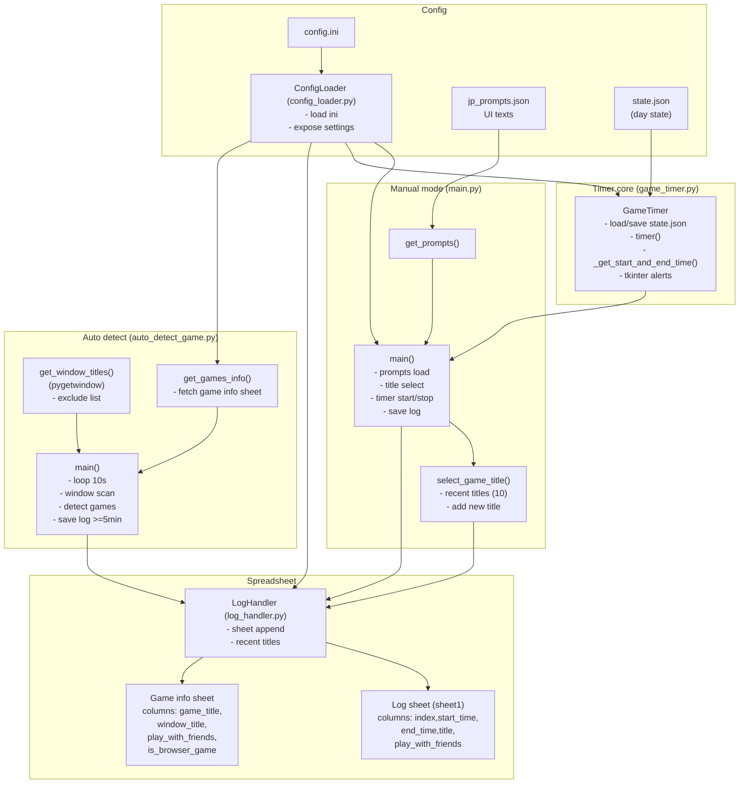

# Game Time Tracker

ゲームのプレイ時間を記録し、Google スプレッドシートへ送信するツールです。手動での計測と、ウィンドウタイトルからの自動検出の2通りを備え、日毎の累積時間と残り時間を確認できます。

## 機能
- 手動計測: `Ctrl+Space` で開始/停止。残り時間と経過時間を表示し、上限の半分/超過で警告ダイアログ (tkinter) を表示。
- 自動検出: フォアグラウンドのウィンドウタイトルからゲームを判定。終了時に5分以上のプレイのみスプレッドシートへ追記。ブラウザゲームの記録可否を設定可能。
- スプレッドシート連携: サービスアカウントでログを追記し、直近プレイタイトル10件を取得してゲーム選択に利用。
- 日次残り時間管理: `state.json` に当日の累積時間と警告フラグを保存し、日付が変わるとリセット。
- 日本語プロンプト: `jp_prompts.json` で CLI の案内文を管理し、自由に差し替え可能。

## セットアップ
1. **Python 環境**
   ```powershell
   python -m venv .venv
   .\.venv\Scripts\activate
   pip install -r requirements.txt
   ```
   - `keyboard` はグローバルキー取得のため、環境によっては管理者権限が必要な場合があります。
   - Windows で `pygetwindow` を使うために `pywin32` が必要です (requirements に含めています)。
   - `tkinter` は Windows 版 Python では標準で含まれます。

2. **Google スプレッドシートの準備**
   1) Google Cloud でサービスアカウントを作成し、「Google Sheets API」と「Google Drive API」を有効化。秘密鍵 JSON をダウンロードして `service_account.json` (パスは `config.ini` で変更可) に保存。  
   2) スプレッドシートを作成し、サービスアカウントのメールアドレスを共有先に追加 (閲覧可/編集可いずれか)。  
   3) URL からキーと gid を取得し、`config.ini` に設定  
      - URL 例: `https://docs.google.com/spreadsheets/d/<sheet_key>/edit#gid=0`  
      - `<sheet_key>` を `LOGHANDLER.sheet_key` と `GAMEINFO.sheet_key` に設定。  
      - 各シートの `gid` を `GAMEINFO.sheet_gid` (ゲーム情報シート) に設定。ログシートは通常 gid=0 の `sheet1` を使用。  
   4) シート構成の例:
      - **ログシート (sheet1)**: ヘッダー行に `index,start_time,end_time,title,play_with_friends`
      - **ゲーム情報シート**: ヘッダー行に `game_title,window_title,play_with_friends,is_browser_game`
        - 真偽値は文字列 `"TRUE"` / `"FALSE"` を想定。
   5) 接続確認 (任意): `.venv` を有効化して以下を実行し、シート名が取得できれば OK。
      ```powershell
      python - <<'PY'
      import gspread
      gc = gspread.service_account(filename="service_account.json")
      sh = gc.open_by_key("<sheet_key>")
      print([ws.title for ws in sh.worksheets()])
      PY
      ```

3. **設定ファイル `config.ini`**
   ```ini
   [APPLICATIONMANAGER]
   use_spreadsheet = True  ; False にするとローカル計測のみ

   [GAMETIMER]
   limit_minutes = 60      ; 1日のプレイ上限（分）
   json_file_path = state.json

   [LOGHANDLER]
   json_file_path = service_account.json
   sheet_key = <ログシートのキー>

   [GAMEINFO]
   sheet_key = <ゲーム情報シートのキー>
   sheet_gid = <ゲーム情報シートの gid>
   ```
   - サンプルは `config.ini.example` を参照してください。
   - ログシートとゲーム情報シートの `sheet_key` が同一でも問題ありません (gid で切り替え)。

4. **初期ファイル**
   - `state.json.example` を `state.json` にコピーして開始できます。日付が変わると自動でリセットされます。
   - プロンプトを変更したい場合は `jp_prompts.json` を編集してください。

## 使い方
### 手動記録 (`main.py`)
1. `python main.py` を実行。
2. Enter で開始し、矢印キーでゲームタイトルを選択 (直近10件 + 新規追加)。`Ctrl+Space` で決定。
3. 友人とプレイするかを `y/n` で入力 (`y` の場合、累積時間に加算せず警告なし)。
4. Enter でタイマー開始。`Ctrl+Space` で停止すると開始/終了時刻を記録し、`use_spreadsheet=True` ならスプレッドシートへ追記します。
5. 残り時間が半分/0 を切ると警告ダイアログを表示します (友人とプレイする場合は表示なし)。

### 自動検出 (`auto_detect_game.py`)
1. ゲーム情報シートに `window_title` と `game_title` を登録 (`is_browser_game` を `"TRUE"` にするとブラウザ上の実行も記録対象)。
2. `python auto_detect_game.py` を実行するか、Windows は `game_time_tracker.bat` から起動。
3. 10秒間隔で表示中のウィンドウを走査し、タイトルが一致するゲームがあれば開始として記録。ウィンドウが消えたら終了として記録し、5分以上なら `[index, start, end, title, play_with_friends]` をスプレッドシートへ追記します。
4. 設定画面やストアなどの除外タイトルは `auto_detect_game.py` の `exclude_titles` で管理しています。

## アーキテクチャ (Mermaid)


## ファイル概要
- `main.py` : 手動タイマーの CLI。スプレッドシートへの書き込みも担当。
- `game_timer.py` : 時間計測と残り時間の表示、警告ダイアログの表示。
- `auto_detect_game.py` : ウィンドウタイトルからゲームを自動検出し、プレイ時間を記録。
- `log_handler.py` : スプレッドシートの読み書きとインデックス管理。
- `config_loader.py` : `config.ini` の読み込みと設定値の提供。
- `jp_prompts.json` : CLI の日本語プロンプト定義。
- `state.json` : 当日の累積プレイ時間と警告表示フラグの保存先。
- `game_time_tracker.bat` : Windows 用の自動検出モード起動スクリプト。

## 注意・ヒント
- 時刻はローカルタイムを使用します。タイムゾーン表示を変更したい場合はスプレッドシート側の表示形式を調整してください。
- `keyboard` の入力取得が効かない場合は、管理者権限でコンソールを開くか、キーの組み合わせを変更してください。
- 自動検出はウィンドウタイトルの部分一致で判定します。タイトルが頻繁に変化するゲームでは、共通する文字列を `window_title` に登録してください。
