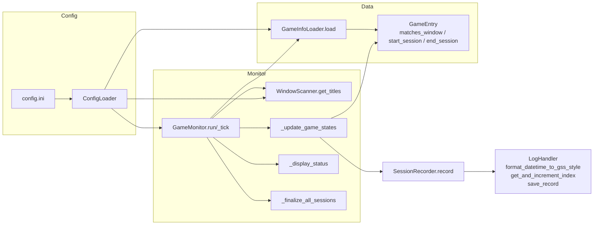

# Game Time Tracker

Windows PC で起動しているアプリケーションのウィンドウタイトルからゲームプレイを自動検出し、Google スプレッドシートへプレイ時間を記録するツールです。

> ⚠️ **Windows 専用**: このツールは `pygetwindow` および `pywin32` を使用しており、Windows 環境でのみ動作します。

## 機能
- **自動検出**: フォアグラウンドのウィンドウタイトルからゲームを判定し、プレイ開始・終了を自動で記録。
- **ブラウザゲーム対応**: ブラウザ上で実行されるゲームの記録可否を個別に設定可能。
- **スプレッドシート連携**: サービスアカウント経由でプレイログを Google スプレッドシートに自動追記。
- **最小記録時間**: 5分未満のプレイは記録対象外（誤検出防止）。
- **柔軟な除外設定**: 設定画面など、記録から除外するウィンドウを指定可能。

## 動作環境
- **OS**: Windows 11
- **Python**: 3.8 以上

## セットアップ

### 1. Python 環境の構築
```powershell
python -m venv .venv
.\.venv\Scripts\activate
pip install -r requirements.txt
```
- `keyboard` はグローバルキー取得のため、Windows では管理者権限が必要な場合があります。
- `pygetwindow` を Windows で利用するには `pywin32` が必要です（requirements に含めています）。

### 2. Google スプレッドシートの準備
1) **Google Cloud でサービスアカウントを作成**
   - Google Cloud Console で新しいプロジェクトを作成。
   - 「Google Sheets API」と「Google Drive API」を有効化。
   - サービスアカウントを作成し、秘密鍵（JSON）をダウンロード。
   - JSON ファイルを `service_account.json` として保存（パスは `config.ini` で変更可）。

2) **スプレッドシートを作成**
   - Google Sheets で新規スプレッドシートを作成。
   - サービスアカウントのメールアドレスを共有先に追加（編集可）。

3) **シート構成を設定**
   - **ログシート (sheet1)**: ヘッダー行 `index,start_time,end_time,title,play_with_friends` を作成。
   - **ゲーム情報シート**: 別シートを用意し、ヘッダー行 `game_title,window_title,play_with_friends,is_browser_game` を作成。

4) **config.ini を設定**
   - スプレッドシート URL から以下を確認：
     - `<sheet_key>`: URL内の `https://docs.google.com/spreadsheets/d/<sheet_key>/edit#gid=0` から取得。
     - `sheet_gid`: ゲーム情報シートの gid（URL末尾の `#gid=<gid>`）。
   - `config.ini` に設定を記入：
     ```ini
     [LOGHANDLER]
     json_file_path = service_account.json
     sheet_key = <ログシートのキー>

     [GAMEINFO]
     sheet_key = <ゲーム情報シートのキー>
     sheet_gid = <ゲーム情報シートの gid>
     ```

5) **接続確認（任意）**
   ```powershell
   python - <<'PY'
   import gspread
   gc = gspread.service_account(filename="service_account.json")
   sh = gc.open_by_key("<sheet_key>")
   print([ws.title for ws in sh.worksheets()])
   PY
   ```

### 3. ゲーム情報の登録
ゲーム情報シートに、プレイするゲームの情報を登録します：

| game_title | window_title | play_with_friends | is_browser_game |
|-----------|-------------|------------------|-----------------|
| Terraria | Terraria | FALSE | FALSE |
| Elden Ring | ELDEN RING | FALSE | FALSE |
| ゲーム1 | GameSite - Google Chrome | TRUE | TRUE |

- **game_title**: スプレッドシートに記録されるゲーム名。
- **window_title**: 監視するウィンドウタイトルの一部（部分一致判定）。
- **play_with_friends**: `"TRUE"` の場合、フレンドとのプレイ（記録対象）。
- **is_browser_game**: `"TRUE"` の場合、ブラウザ上のプレイも記録対象。`"FALSE"` の場合はブラウザを除外。

## 使い方

### 自動検出モード（メイン機能）

#### PowerShell での起動
```powershell
python main.py
```

### GUI 版（PySide6）
```powershell
python gui.py
```
- プレイ中のゲームと経過時間、現在のウィンドウタイトルを一覧表示します。
- スプレッドシートへの記録タイミングや検出ロジックは CLI 版と同じです。
- 表示モードは左クリックでトグル（max=全表示、mid=ウィンドウタイトル非表示、min=今日のプレイ時間のみ）。モード・位置・サイズは `window_state.txt` に保存/復元されます。
- ウィンドウ検出は 1 秒間隔、UI 更新は 0.1 秒間隔です。

#### Windows バッチファイルでの起動（推奨）
```powershell
.\game_time_tracker.bat
```
Windows タスクスケジューラで定期実行したい場合は、このバッチファイルを登録してください。

#### 実行時の動作
起動すると、1秒間隔（`POLL_INTERVAL_SECONDS`）で表示中のウィンドウをスキャンします：
- ウィンドウタイトルが登録されたゲームと一致したら、プレイ開始として記録。
- ウィンドウが消失したら、プレイ終了として記録。
- 5分以上（`MIN_PLAY_MINUTES`）のプレイのみスプレッドシートに追記。

出力例：
```
ゲームをプレイしていません
現在のウィンドウタイトルは以下です。
- Visual Studio Code
- Windows Explorer
```

ゲーム実行中（複数タイトルも出力可）：
```
Terrarioをプレイ中（経過: 3分12秒）
```

プレイ終了時（5分以上）：
```
Terrariaのプレイ時間を記録しました
```

## ファイル構成
- [main.py](main.py) : 自動検出メインループ。`GameMonitor` クラスがウィンドウスキャンとログ記録を担当。
- [game_time_tracker.bat](game_time_tracker.bat) : Windows バッチファイル。仮想環境を有効化して main.py を実行（日々の起動はこちらから）。
- [log_handler.py](log_handler.py) : スプレッドシート操作（読み込み・追記・インデックス管理）。
- [config_loader.py](config_loader.py) : `config.ini` の読み込みと設定値管理。ブラウザ判定/除外タイトルはここで定義。
- [config.ini](config.ini) : スプレッドシートのキーや認証情報を指定。
- [service_account.json](service_account.json) : Google Cloud サービスアカウント秘密鍵（.gitignore で除外）。

## 設定ファイル（config.ini）
```ini
[LOGHANDLER]
json_file_path = service_account.json      ; サービスアカウント JSON のパス
sheet_key = <スプレッドシートキー>         ; ログシートのキー

[GAMEINFO]
sheet_key = <スプレッドシートキー>         ; ゲーム情報シートのキー
sheet_gid = 1198224769                     ; ゲーム情報シートの gid

[WINDOW_SCAN]
browsers = Google Chrome, Microsoft Edge, Mozilla Firefox, Opera, Brave, Vivaldi, Safari  ; ブラウザ名（部分一致）
exclude_titles = Program Manager, Settings, 設定, NVIDIA GeForce Overlay, Windows 入力エクスペリエンス, Microsoft Store, game_time_tracker.bat, Nahimic
```

## 注意・トラブルシューティング

### ウィンドウタイトルが認識されない
- [config.ini](config.ini) の `[WINDOW_SCAN]` セクションで `exclude_titles` を確認・編集してください（未設定時は `config_loader.py` のデフォルト値を使用）。
- ゲーム情報シートの `window_title` が、実際のウィンドウタイトル（の一部）と一致しているか確認してください。
- 実際のウィンドウタイトルは実行中に出力されます。

### ブラウザゲームが記録されない
- ゲーム情報シートの `is_browser_game` が `"TRUE"` に設定されているか確認。
- ウィンドウタイトルにブラウザ名（Chrome、Edge等）が含まれている場合、`window_title` にはゲーム固有の文字列を含める必要があります。

### スプレッドシートへの接続エラー
- `service_account.json` のパスが正しいか確認。
- サービスアカウントのメールアドレスがスプレッドシートで共有されているか確認。
- API キーが有効か確認（Google Cloud Console で確認）。

### キー入力が効かない
- Windows では管理者権限でコンソールを開いてください。
- または、`keyboard` ライブラリの代替方法を検討してください。

## 開発向け
- テスト実行: `python -m unittest`
- 監視間隔や最小記録時間は `main.py` 冒頭の定数（`POLL_INTERVAL_SECONDS`, `MIN_PLAY_MINUTES`）で変更できます（デフォルト 1 秒）。
- 監視対象ブラウザ・除外ウィンドウは `config.ini` の `[WINDOW_SCAN]` で変更できます（未設定時は `config_loader.py` のデフォルト値）。

## 開発ガイド
- 仮想環境: `python -m venv .venv && .\.venv\Scripts\activate && pip install -r requirements.txt`
- 実行: `python main.py`（Google Sheets への書き込みが発生するため必要なら別シートで検証）
- 設定: `config.ini` にログシート・ゲーム情報シートのキーと gid、サービスアカウント JSON のパスを指定
- テスト: 依存をスタブ化した単体テストを `python -m unittest` で実行
- 拡張例:
  - ポーリング間隔・最小記録時間の変更は `POLL_INTERVAL_SECONDS`, `MIN_PLAY_MINUTES`
  - 対応ブラウザや除外ウィンドウの追加は `config.ini` の `[WINDOW_SCAN]`（未設定時は `config_loader.py` のデフォルト値）
  - ゲーム情報の再読込や CLI/UI の追加は `GameMonitor` を拡張

### クラス/メソッドの関係図（Mermaid）


## ライセンス
MIT License
