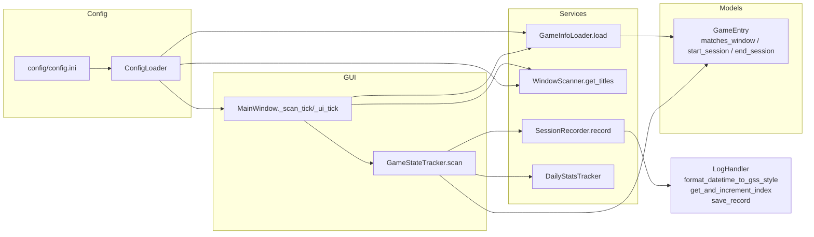

# Game Time Tracker

Windows PC で起動しているアプリケーションのウィンドウタイトルからゲームプレイを自動検出し、ローカル SQLite にプレイ時間を記録するツールです。Google スプレッドシートは初回ゲーム情報取り込みとプレイログのバックアップに使用できます。

> ⚠️ **Windows 専用**: このツールは `pygetwindow` および `pywin32` を使用しており、Windows 環境でのみ動作します。

## 機能
- **自動検出**: 起動中のウィンドウタイトルからゲームを判定し、プレイ開始・終了を自動で記録。
- **手入力記録**: ウィンドウタイトルで検出できないゲームも、登録済みゲームを選んで開始/停止ボタンまたは開始/終了日時入力で記録。
- **フォアグラウンド検出**: 最前面（フォアグラウンド）のウィンドウのみをアクティブなプレイとして判定。
- **非アクティブ時の自動分割**: ゲームウィンドウが5分以上非アクティブ（バックグラウンド）になると、その時点でセッションを自動記録。再度アクティブになった際は新しいセッションとして計測。
- **タスクトレイ常駐**: アプリ本体はタスクトレイに常駐し、必要な時だけメインウィンドウを表示。×ボタンでは終了せず、トレイに戻ります。
- **今日のプレイ時間オーバーレイ**: プレイ中ゲームがある場合、今日のプレイ時間をゲーム画面上に補完表示できます。オーバーレイは左端ハンドルのドラッグで移動できます。
- **ブラウザゲーム対応**: ブラウザ上で実行されるゲームの記録可否を個別に設定可能。
- **ゲーム管理**: ゲームタイトル、検出用ウィンドウタイトル、ブラウザゲーム設定をローカルDBで追加・編集・削除。ゲーム管理画面の表示時と終了時に、可能ならスプレッドシートと同期します。
- **ローカルDB記録 + スプレッドシートバックアップ**: プレイログは `data/play_logs.sqlite3` に保存し、サービスアカウント経由で Google スプレッドシートへバックアップ。
- **最小記録時間**: 5分未満のプレイは記録対象外（誤検出防止）。
- **日跨ぎ対応**: 深夜0時を跨いでプレイした場合、日付ごとに分割して正確に記録。
- **柔軟な除外設定**: 設定画面など、記録から除外するウィンドウを指定可能。
- **堅牢なエラーハンドリング**: 設定ファイルの検証、ローカル保存失敗時の検知、スプレッドシートバックアップ失敗時の継続処理。

## 動作環境
- **OS**: Windows 11
- **利用者**: Python 不要（配布 EXE を使用）
- **開発者**: Python 3.10 以上

## 利用者向けセットアップ（EXE）

### 1. EXE の入手
- GitHub Releases から `game_time_tracker-windows.zip` をダウンロードして展開します。
- ZIP には `game_time_tracker.exe` / `_internal/` / `config/config.ini.example` / `README.md` が含まれます。`_internal/` は PySide6 などの実行時依存を含むため、EXE と同じ階層に置いてください。

### 2. Google スプレッドシートの準備
1) **Google Cloud でサービスアカウントを作成**
   - Google Cloud Console で新しいプロジェクトを作成。
   - 「Google Sheets API」と「Google Drive API」を有効化。
   - サービスアカウントを作成し、秘密鍵（JSON）をダウンロード。
   - JSON ファイルを `service_account.json` として保存（パスは `config/config.ini` で変更可）。

2) **スプレッドシートを作成**
   - Google Sheets で新規スプレッドシートを作成。
   - サービスアカウントのメールアドレスを共有先に追加（編集可）。

3) **シート構成を設定**
   - **ログシート**: ヘッダー行 `record_id,device_id,index,start_time,end_time,title,play_with_friends` を作成。
     - `record_id` は複数PC同期用の一意ID、`device_id` は記録元PC名です。
     - 末尾に集計用の計算列を追加しても、同期時は上記の列だけを読み取ります。
     - 旧ヘッダーの `No`（index相当）と `with_friends` も取り込み互換のため読み取れます。
   - **ゲーム情報シート**: 初回取り込み用に別シートを用意し、ヘッダー行 `id,game_title,window_title,play_with_friends,is_browser_game` を作成。`id` が空の場合はローカルDB取り込み時に UUID を採番します。

4) **config/config.ini を設定**
   - スプレッドシート URL から以下を確認：
     - `<sheet_key>`: URL内の `https://docs.google.com/spreadsheets/d/<sheet_key>/edit#gid=0` から取得。
     - `sheet_gid`: 対象シートの gid（URL末尾の `#gid=<gid>`）。ログシート、ゲーム情報シートそれぞれで指定できます。
   - `config/config.ini.example` を `config/config.ini` にコピーして設定を記入：
     ```ini
     [LOGHANDLER]
     json_file_path = service_account.json
     backup_mode = spreadsheet
     sheet_key = <ログシートのキー>
     sheet_gid = <ログシートの gid>
     sync_conflict_policy = overwrite

     [GAMEINFO]
     sheet_key = <ゲーム情報シートのキー>
     sheet_gid = <ゲーム情報シートの gid>
     ```

5) **接続確認（任意）**
  - 初回起動時にエラーが出ないことをもって接続確認とするのが簡単です。
  - 開発者がPythonで検証したい場合は、後述の「開発向け」を参照してください。

### 3. ゲーム情報の登録
ゲーム情報は `data/game_catalog.sqlite3` に保存され、右クリックメニューの `ゲーム管理` から追加・編集・削除できます。ゲーム管理画面を開いた時と閉じた時は、接続できる場合にスプレッドシートとの同期も実行します。

初回取り込み、ゲーム管理画面の自動同期、または手動同期でスプレッドシートを使う場合は、ゲーム情報シートにプレイするゲームの情報を登録します：

| id | game_title | window_title | play_with_friends | is_browser_game |
|----|------------|-------------|------------------|-----------------|
| 1 | Terraria | Terraria | FALSE | FALSE |
| 2 | Elden Ring | ELDEN RING | FALSE | FALSE |
| 3 | ゲーム1 | GameSite - Google Chrome | TRUE | TRUE |

- **id**: ローカルDBとスプレッドシート同期で使うゲームID。空の場合はローカル取り込み時にUUIDを採番します。
- **game_title**: プレイログに記録されるゲーム名。
- **window_title**: 監視するウィンドウタイトルの一部（部分一致判定）。
- **play_with_friends**: `"TRUE"` の場合、フレンドとのプレイ（記録対象）。
- **is_browser_game**: `"TRUE"` の場合、ブラウザ上のプレイも記録対象。`"FALSE"` の場合はブラウザを除外。

## 使い方

### GUI での起動（メイン機能）

#### EXE で起動（推奨）
- `game_time_tracker.exe` を起動します。
- 起動後はタスクトレイに常駐します。起動時にメインウィンドウを表示するかどうかは、トレイアイコン右クリックメニューの `起動時` から `ウィンドウを表示` / `ウィンドウを非表示` を選んで保存できます。
- タスクトレイアイコンを右クリックすると、状態に応じて `ウィンドウを表示` または `ウィンドウを非表示` を表示します。`終了` を選ぶと、プレイ中セッションを記録してアプリを完全終了します。
- メインウィンドウの × ボタンはアプリ終了ではなく、ウィンドウを非表示にしてタスクトレイ常駐へ戻ります。この操作ではプレイ中セッションは終了しません。
- プレイ中のゲームと経過時間、現在のウィンドウタイトルを一覧表示します。
- maxモードの「現在のウィンドウタイトル」一覧は、行をクリックするとそのタイトル文字列をクリップボードにコピーできます。行を右クリックして `ゲーム一覧に追加` を選ぶと、ウィンドウタイトルが入力された状態でゲーム管理画面を開けます。
- ローカルDBへの記録タイミングや検出ロジックは自動です。
- 表示モードは左クリックでトグル：
  - **max**: 全表示（今日のプレイ時間、セッション時間、プレイ中のゲーム、今日プレイしたゲーム一覧、ウィンドウタイトル）
  - **mid**: 今日のプレイ時間、セッション時間、プレイ中のゲーム、今日プレイしたゲーム一覧（ウィンドウタイトルは非表示）
  - **min**: 今日のプレイ時間のみ
- 画面最下部に `時間超過防止アラート` スイッチを表示（`max/mid/min` 全モード）。
  - 左詰め配置（ラベルの右にスイッチ）
  - ノブが左右に移動する小型スライドスイッチ
  - OFF時はアラート音を停止
- **今日のプレイ時間オーバーレイ**:
  - メインウィンドウ非表示中は、トレイメニューの `オーバーレイ表示` が有効で、かつプレイ中ゲームがある場合に表示します。
  - メインウィンドウ表示中は、今日のプレイ時間表示が他ウィンドウに覆われている場合だけ補完表示します。この表示はトレイメニューの `オーバーレイ表示` チェックに依存しません。
  - オーバーレイ本体はクリック透過で、左端の細いハンドルだけドラッグ操作を受け付けます。ハンドルをドラッグすると表示位置を移動でき、位置は保存されます。
- **今日プレイしたゲーム一覧**（mid/max モードで表示）:
  - その日にプレイしたゲームとそれぞれのプレイ時間（分数）を表示
  - プレイ時間の長い順にソート
  - 現在プレイ中のゲームの時間も含めてリアルタイムに更新（**5分以上のセッションのみ**）
  - 日跨ぎセッションは当日0:00以降の分のみカウント
- メインウィンドウまたはタスクトレイアイコンを右クリックすると、`手入力で記録` / `レポート` / `ゲーム管理` / `設定` / `終了` などのメニューを表示します。
- `手入力` では登録済みゲームをプルダウンから選び、開始/停止ボタンで経過時間を見ながらローカルDBへ記録できます。開始日時と終了日時は手修正でき、5分未満のプレイは自動記録と同じく記録対象外です。フレンドプレイ有無はゲーム管理に保存された設定を使います。
- `レポート` の `ログ` タブではプレイログ一覧を確認でき、選択したログの編集保存・削除と、`スプシ同期` からプレイログシートの手動同期ができます。スプレッドシート側のログを取り込み、未バックアップのローカルログを送信します。同期後は取得件数、取込件数、取込スキップ件数、未送信件数、バックアップ件数、失敗件数、上書き/別ID採番件数、エラー原因をステータスに表示します。
- レポート画面は表示中タブだけを更新し、未表示タブは開いた時に集計・描画します。同期やログ編集後も未表示タブは dirty 扱いにして、必要になるまで再計算しません。
- `ゲーム管理` ではゲーム名、検出用ウィンドウタイトル、フレンドプレイ、ブラウザゲームの設定を追加・編集・削除できます。変更は `data/game_catalog.sqlite3` に保存され、保存後に監視対象を再読み込みします。画面を開いた時はローカル定義を先にスプレッドシートへ送信してから取得し、画面を閉じる時もローカル定義をスプレッドシートへ送信します（接続できない場合はローカル操作を継続）。
- `ゲーム管理` の `スプシから取得` はゲーム情報シートを手動取得し、`id` をキーにローカルDBへ反映します。シートにない既存IDは無効化され、一覧の二重表示を避けます。
- `ゲーム管理` の `スプシへ送信` は有効なローカルゲームをゲーム情報シートへ反映します。既存の `id` は更新し、シートにない `id` は追記します。ローカルで削除済みのゲームは自動ではシートから削除しません。
- `設定` では認証JSON、プレイログ保存モード、シート key、sheet_gid、対象ブラウザ、除外タイトルを編集できます。認証JSONはファイル選択で指定できます。
- プレイログ保存モードは `ローカルのみで運用` / `スプレッドシートにバックアップ` から選択できます。`ローカルのみで運用` の場合、ログシート key / sheet_gid は不要です。
- `ID重複時` は `スプシを上書き` / `別IDで追加` から選択できます。複数PC同期で同じ `record_id` が見つかった場合の処理です。
- 設定画面で保存した内容は `data/settings.sqlite3` へ保存されます。`config/config.ini` は設定画面の `設定Export` / `設定Import` で手動入出力できます。
- 表示モード・ウィンドウ位置/サイズ・起動時のウィンドウ表示設定・トレイ用オーバーレイ設定/位置は `data/settings.sqlite3` に保存/復元されます。
- ウィンドウ検出は 1 秒間隔、UI 更新は 0.1 秒間隔です。
- **ローカルDB優先の記録処理**:
  - プレイログは `data/play_logs.sqlite3` に保存し、起動時にメモリ上へキャッシュ（`List[dict]`形式）
  - UI更新時はキャッシュから取得（Spreadsheet APIを呼び出さない）
  - ゲーム記録時はローカルDBを先に更新し、追加した1件だけをスプレッドシートへバックアップ
  - バックアップ有効時は起動時と手動同期時にスプレッドシートのログをローカルDBへ同期
  - バックアップできなかったレコードは次回起動時に再バックアップ
  - スプレッドシート取得に失敗した場合は、その回のバックアップ送信を止め、未バックアップ状態のまま次回に再試行します。
  - 複数PCからの記録は `record_id` で識別し、`device_id` で記録元PCを残します。
  - `record_id` がスプレッドシート側に既にある場合は、設定に応じて既存行を上書きするか、別IDを採番して新規行として追加します。

#### 設定ファイルの配置（EXE）
- 通常起動時の設定は `data/settings.sqlite3` から読み込まれます。
- `data/settings.sqlite3` に有効な設定がなく `config/config.ini` がある場合は、初回移行として `config/config.ini` を SQLite へ取り込みます。
- 旧配置の `config.ini` が残っている場合は、初回起動時に `config/config.ini` へ移動します。
- `service_account.json` は EXE と同じフォルダに置く運用を推奨します（`config/config.ini` 側で相対パス指定可能）。
- `config/config.ini` も SQLite も未設定の場合は、起動時に設定画面を表示します。
- ログは `logs/game_time_tracker.log` に出力され、1MB + 3世代までローテートします。
- ゲーム情報は `data/game_catalog.sqlite3` に保存されます。
- プレイログは `data/play_logs.sqlite3` に保存されます。
- ウィンドウ状態は `data/settings.sqlite3` に保存されます。旧 `data/window_state.txt` は初回起動時に SQLite へ取り込まれます。
- 旧配置の `game_time_tracker.log` / `window_state.txt` が残っている場合は、初回起動時にそれぞれ `logs/` / `data/` へ移動してから必要に応じて SQLite に取り込みます。

#### 実行時の動作
起動すると、1秒間隔（`POLL_INTERVAL_SECONDS = 1`）で起動中のウィンドウをスキャンします：
- ウィンドウタイトルが登録されたゲームと一致し、かつフォアグラウンド（最前面）ならプレイ中として計測。
- ゲームウィンドウがバックグラウンドになると「ゲーム名 - 停止中」と表示。
- バックグラウンド状態が5分未満で復帰した場合、セッションは継続（停止時間も含む）。
- バックグラウンド状態が5分以上続くと、その時点でセッションを自動記録。次にフォアグラウンドになった際は新しいセッションとして計測。
- ウィンドウが消失したら、プレイ終了として記録。
- 5分以上（`MIN_PLAY_MINUTES`）のプレイのみローカルDBに記録し、スプレッドシートへバックアップ。
- タイトルバーにステータスを表示、記録時のメッセージは標準出力に表示。

## ファイル構成

### アプリケーションコード
- [src/app/main.py](src/app/main.py) : PySide6 GUI（`MainWindow` クラス）。イベント処理と各 controller への委譲を担当。
- [src/core/models.py](src/core/models.py) : データモデル（`GameEntry`, `ParsedRecord`）とパース関数。
- [src/core/domain.py](src/core/domain.py) : UIや外部I/Oに依存しないドメインロジック（`GameStateTracker`, `DailyStatsTracker`, `ScanResult`）。
- [src/core/adapters.py](src/core/adapters.py) : 外部I/Oに触れるアダプター（`GameInfoLoader`, `WindowScanner`, `SessionRecorder`）。
- [src/core/window_state.py](src/core/window_state.py) : ウィンドウ状態の保存/読み込み（`WindowState`）。
- [src/ui/gui_layout.py](src/ui/gui_layout.py) : UIレイアウト構築。
- [src/ui/game_catalog_dialog.py](src/ui/game_catalog_dialog.py) : ローカルゲーム情報の追加・編集・削除画面。
- [src/ui/report_dialog.py](src/ui/report_dialog.py) : プレイログの集計・グラフ・ログ編集ダイアログ。
- [src/ui/report_charts.py](src/ui/report_charts.py) : レポート用 QtCharts の生成、色決定、チャートビュー生成。
- [src/ui/report_graph_unit.py](src/ui/report_graph_unit.py) : レポートグラフの分/時間切替と再描画制御。
- [src/ui/report_log_operations.py](src/ui/report_log_operations.py) : レポートログ編集・削除の非同期実行と完了処理。
- [src/ui/report_log_table.py](src/ui/report_log_table.py) : レポートログテーブルの表示・選択行の編集フォーム反映。
- [src/ui/report_summary_table.py](src/ui/report_summary_table.py) : ゲーム別集計ラベル・テーブル表示。
- [src/ui/report_sync_messages.py](src/ui/report_sync_messages.py) : スプレッドシート同期結果のステータスメッセージ整形。
- [src/ui/report_tab_refresh.py](src/ui/report_tab_refresh.py) : レポートダイアログのタブ遅延更新・dirty 状態管理。
- [src/ui/report_tab_state.py](src/ui/report_tab_state.py) : レポートタブの loaded/dirty 状態と集計キャッシュ。
- [src/ui/report_title_filter.py](src/ui/report_title_filter.py) : レポート推移タブのタイトル選択・一括選択状態管理。
- [src/ui/report_trend_selection.py](src/ui/report_trend_selection.py) : 推移グラフの範囲選択・選択範囲テーブル更新。
- [src/ui/report_date_ranges.py](src/ui/report_date_ranges.py) : レポート期間プリセットの日付範囲計算。
- [src/infra/log_handler.py](src/infra/log_handler.py) : プレイログの読み書き窓口。ローカルDBを主保存先にし、スプレッドシートへのバックアップとキャッシュ更新を担当。
- [src/infra/play_log_analytics.py](src/infra/play_log_analytics.py) : キャッシュ済みプレイログから今日統計・レポート・推移データを計算。
- [src/infra/play_log_backup.py](src/infra/play_log_backup.py) : スプレッドシートバックアップ、未送信キュー、手動同期の内部処理。
- [src/infra/play_log_store.py](src/infra/play_log_store.py) : `data/play_logs.sqlite3` へのプレイログ保存・読み込み・バックアップ状態管理。
- [src/infra/game_catalog_store.py](src/infra/game_catalog_store.py) : `data/game_catalog.sqlite3` へのゲーム情報保存・読み込み・論理削除。
- [src/infra/sqlite_base_store.py](src/infra/sqlite_base_store.py) : SQLite store 共通の接続・トランザクション管理、`PRAGMA user_version` によるスキーマバージョン記録。
- [src/infra/config_loader.py](src/infra/config_loader.py) : SQLite 設定の読み込みと `config/config.ini` 初回移行。ブラウザ判定/除外タイトルはここで定義。
- [src/infra/settings_repository.py](src/infra/settings_repository.py) : SQLite をランタイム設定の正とし、INI 初回移行・明示 import/export との境界を管理。
- [src/infra/settings_store.py](src/infra/settings_store.py) : `data/settings.sqlite3` への設定値・ウィンドウ状態の保存。
- [src/infra/log_config.py](src/infra/log_config.py) : アプリ起動時のロギング初期化とログファイル設定。

### 設定・その他
- [game_time_tracker.bat](game_time_tracker.bat) : 開発者向けのWindowsバッチファイル。仮想環境を有効化して main.py を実行。
- `config/config.ini` : 設定画面の Import/Export 用 INI。SQLite 未設定時の初回移行にも使用。
- [service_account.json](service_account.json) : Google Cloud サービスアカウント秘密鍵（.gitignore で除外）。
- [.github/workflows/release-exe.yml](.github/workflows/release-exe.yml) : GitHub Releases 公開時に Windows EXE を自動ビルドして添付。

## 設定ファイル（config/config.ini）
```ini
[LOGHANDLER]
json_file_path = service_account.json      ; サービスアカウント JSON のパス
backup_mode = spreadsheet                  ; spreadsheet または local_only
sheet_key = <スプレッドシートキー>         ; ログシートのキー
sheet_gid = 0                              ; ログシートの gid（省略時は sheet1）
sync_conflict_policy = overwrite           ; overwrite または new_id

[GAMEINFO]
sheet_key = <スプレッドシートキー>         ; ゲーム情報シートのキー
sheet_gid = 1198224769                     ; ゲーム情報シートの gid

[WINDOW_SCAN]
browsers = Google Chrome, Microsoft Edge, Mozilla Firefox, Opera, Brave, Vivaldi, Safari  ; ブラウザ名（部分一致）
exclude_titles = Program Manager, Settings, 設定, NVIDIA GeForce Overlay, Windows 入力エクスペリエンス, Microsoft Store, game_time_tracker.bat, Nahimic
```

## 注意・トラブルシューティング

### ウィンドウタイトルが認識されない
- `config/config.ini` の `[WINDOW_SCAN]` セクションで `exclude_titles` を確認・編集してください（未設定時は `config_loader.py` のデフォルト値を使用）。
- ゲーム情報シートの `window_title` が、実際のウィンドウタイトル（の一部）と一致しているか確認してください。
- 実際のウィンドウタイトルはGUIウィンドウの「現在のウィンドウタイトル」リスト（maxモード）で確認できます。
- 「現在のウィンドウタイトル」リストはクリックでコピーできます。右クリックの `ゲーム一覧に追加` から、選択したタイトルを `window_title` に入れた状態でゲーム管理画面を開けます。

### ブラウザゲームが記録されない
- ゲーム情報シートの `is_browser_game` が `"TRUE"` に設定されているか確認。
- ウィンドウタイトルにブラウザ名（Chrome、Edge等）が含まれている場合、`window_title` にはゲーム固有の文字列を含める必要があります。

### スプレッドシートへの接続エラー
- `service_account.json` のパスが正しいか確認。
- サービスアカウントのメールアドレスがスプレッドシートで共有されているか確認。
- API キーが有効か確認（Google Cloud Console で確認）。
- プレイログのローカル保存は継続されます。バックアップできなかったレコードは次回起動時に再バックアップされます。

### EXE 起動時にグラフが表示されない
- `game_time_tracker.exe` と同じ階層に `_internal/` フォルダがあるか確認してください。PySide6.QtCharts などの依存モジュールは `_internal/` 側に含まれます。

### 設定のエラー
- `data/settings.sqlite3` と `config/config.ini` のどちらにも必須項目（`[LOGHANDLER]` の `json_file_path` 、`[GAMEINFO]` の `sheet_key`, `sheet_gid`）がない場合は、起動時に設定画面を表示します。`[LOGHANDLER] sheet_key` は `backup_mode = spreadsheet` の場合のみ必須です。
- 認証JSONファイルが見つからない場合は、警告を表示して設定画面を開きます。
- `sheet_gid` は整数値で指定してください（例: `sheet_gid = 1198224769`）。

## 開発向け
- テスト実行: `python -m pytest -q`
- 監視間隔は `src/app/main.py` 冒頭の定数で変更できます：
  - `POLL_INTERVAL_SECONDS = 1`（デフォルト: 1秒）
- 最小記録時間は `src/core/domain.py` の定数で変更できます：
  - `MIN_PLAY_MINUTES = 5`（デフォルト: 5分）
- 監視対象ブラウザ・除外ウィンドウは設定画面で変更できます（未設定時は `config_loader.py` のデフォルト値）。
- モジュール構成:
  - `src/core`: ドメイン層（`models.py`, `domain.py`, `adapters.py`, `time_utils.py`, `window_state.py`）
  - `src/infra`: 外部連携・保存層（`config_loader.py`, `gspread_service.py`, `log_config.py`, `log_handler.py`, `play_log_analytics.py`, `play_log_backup.py`, `play_log_store.py`, `settings_repository.py`, `sqlite_base_store.py`）
  - `src/ui`: UIレイアウトとダイアログ（`gui_layout.py`, `report_dialog.py`, `report_charts.py`, `report_graph_unit.py`, `report_log_operations.py`, `report_log_table.py`, `report_summary_table.py`, `report_sync_messages.py`, `report_tab_refresh.py`, `report_tab_state.py`, `report_title_filter.py`, `report_trend_selection.py`, `report_date_ranges.py`）
  - `src/app`: エントリーポイント/UI制御（`main.py`, `controllers/`, `session_state.py`, `cover_detector.py`, `overlay_window.py`, `display_modes.py`）
  - ルートの `main.py` は実行エントリです。実装は `src/` 配下にあります。

## 開発ガイド
- 仮想環境: `python -m venv .venv && .\.venv\Scripts\activate && pip install -r requirements.txt`
- 実行: `python main.py`（ローカルDBへの書き込みと Google Sheets へのバックアップが発生するため必要なら別シートで検証）
- 設定: 初回起動時の設定画面でプレイログ保存モード、ログシート・ゲーム情報シートのキーと gid、サービスアカウント JSON のパスを指定
- テスト: 依存をスタブ化した単体テストを `python -m pytest -q` で実行（`tests/` 配下）
- 拡張例:
  - ポーリング間隔の変更は `src/app/main.py` の `POLL_INTERVAL_SECONDS`
  - 最小記録時間の変更は `src/core/domain.py` の `MIN_PLAY_MINUTES`
  - 対応ブラウザや除外ウィンドウの追加は設定画面（未設定時は `config_loader.py` のデフォルト値）
  - 新しいデータモデルは `src/core/models.py` に追加
  - 新しい純粋ロジックは `src/core/domain.py`、外部I/Oを伴う処理は `src/core/adapters.py` に追加
  - UIの拡張は `src/app/main.py` の `MainWindow` から委譲される controller 側に追加し、呼び出し側は `src/app/controllers/` の公開 import 面を使う

### クラス/メソッドの関係図（Mermaid）

```mermaid
flowchart LR
    subgraph Config
        C[config/config.ini] --> CL[ConfigLoader]
    end
    subgraph Models
        GE[GameEntry<br/>matches_window / start_session / end_session]
    end
    subgraph Services
        GIL[GameInfoLoader.load] --> GE
        WS[WindowScanner.get_titles]
        SR[SessionRecorder.record]
        DS[DailyStatsTracker]
    end
    subgraph GUI
        MW[MainWindow._scan_tick/_ui_tick]
        GST[GameStateTracker.scan]
    end

    MW --> WS
    MW --> GST
    GST --> GE
    GST --> SR
    GST --> DS
    SR --> LH[LogHandler<br/>format_datetime_to_gss_style<br/>get_and_increment_index<br/>save_record]

    CL --> MW
    CL --> GIL
    CL --> WS
    MW --> GIL
```

## ライセンス
MIT License

## ドキュメント追記（2026-03）
- タイトル判定は正規化前提に変更:
  - `GameStateTracker.scan()` で `window_titles` / `foreground_title` を 1 回だけ正規化してから判定します。
  - `GameEntry.matches_window()` は正規化済み入力を受け取り、`window_title` の正規化結果を内部キャッシュして比較します。
- 正規化の仕様:
  - 大文字/小文字を吸収（`casefold`）
  - ダッシュ記号バリエーションを `-` に統一
  - 余分な空白を正規化
- 追加モジュール:
  - `text_utils.py` に `normalize_title()` を追加
- `GameStateTracker` の内部リファクタ:
  - `_check_window_exists()` / `_check_is_foreground()` は `browsers` 引数を廃止し、内部キャッシュ `self._normalized_browsers` を直接参照。
  - 記録後の `DailyStatsTracker` 更新処理を `_apply_recorded_seconds()` に集約し、`_handle_window_closed()` と `_handle_inactive_timeout()` の重複を解消。
  - `set_browsers()` で空の正規化結果を除外してキャッシュを保持。
  - `WindowMatchState` を導入し、`scan()` での「存在判定/フォアグラウンド判定」の受け渡しを明示化。
  - `LoadTodayMinutes` 型エイリアスで、コールバック型を1箇所に集約。
- `MainWindow` の内部リファクタ:
  - 初期化エラー処理を `_disable_with_status()` と `_create_log_handler()` に分離し、`_init_components()` の責務を整理。
  - プレイ中ゲームの統合取得を `_all_playing_games()` に集約し、UI更新系メソッドの重複を削減。
  - 初期化フローを `_load_config_and_games()` / `_build_scanner()` / `_initialize_tracking_services()` / `_load_today_stats_cache()` に分割。
  - スキャンフローを `_scan_games()` / `_apply_scan_result()` / `_update_scan_status()` に分割し、`_scan_tick()` をオーケストレーション専用に整理。
  - UI更新ロジックを `MainWindowUiController` に分離し、`MainWindow` はイベント駆動と状態遷移のオーケストレーションに集中。
  - 表示モード切替ロジックを `MainWindowDisplayController` に分離し、`_apply_display_mode()` / `_apply_mode_geometry()` / `_cycle_display_mode()` を薄い委譲メソッド化。
  - ウィンドウ状態の保存・復元ロジックを `MainWindowStateController` に分離し、`_save_window_state()` / `resizeEvent()` / 初期ロードを委譲化。
  - 初期化依存構築を `MainWindowBootstrapper` に分離し、`_init_components()` は「エラー処理 + 反映」に限定。
  - タイマー起動と tick 実行フローを `MainWindowLoopController` に分離し、`_start_timer()` / `_scan_tick()` / `_ui_tick()` を委譲化。
  - 初期化エラーのドメイン例外として `MainWindowBootstrapError` を導入し、`_init_components()` の例外境界を単純化。
  - コントローラー/ブートストラッパー取得の重複ロジックを `_resolve_dependency()` に集約し、各 `_get_*` メソッドを「依存定義 + 再生成条件」だけに整理。
  - `__init__` の起動手順を `_initialize_window_state()` / `_initialize_runtime_state()` / `_warmup_dependencies()` / `_start_background_timers()` / `_run_initial_refresh()` に分割し、起動フローを段階的に把握しやすく整理。
  - UIイベント処理を小メソッドに分割し、`closeEvent()` / `mousePressEvent()` / `resizeEvent()` をオーケストレーションに限定（`_record_playing_games_before_close()` / `_should_cycle_display_mode()` / `_record_current_mode_size()`）。
