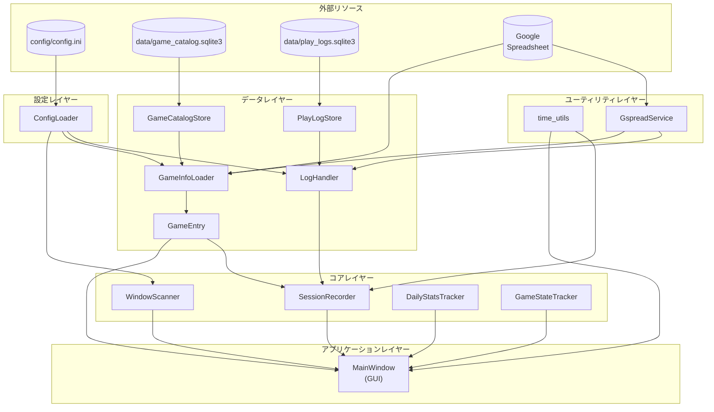
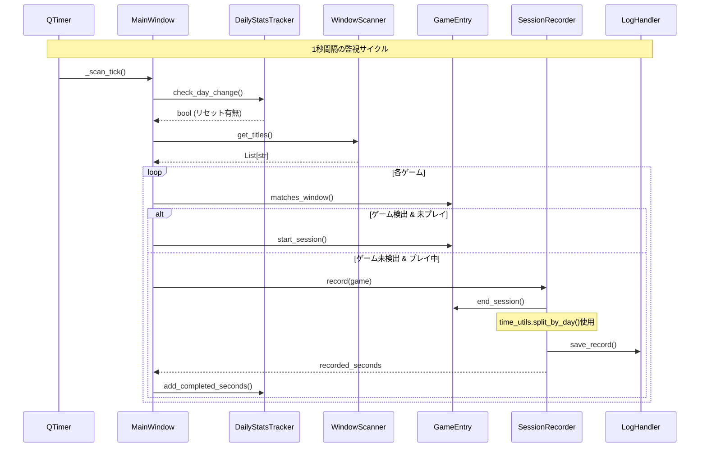

# Game Time Tracker 仕様書

## 目的
Windows PC で実行中のゲームをウィンドウタイトルから自動検出し、プレイ時間をローカル SQLite に記録するツール。Google スプレッドシートは初回ゲーム情報取り込みとプレイログのバックアップに使用できる。

## 運用前提（配布形態）
- 通常利用は GitHub Releases で配布する Windows EXE を前提とする。
- `config/config.ini` / `service_account.json` は EXE に同梱せず、実行時に外部ファイルとして参照する。
- 既定では `data/settings.sqlite3` の設定を読み込む。SQLite に有効な設定がなく `config/config.ini` がある場合のみ、初回移行として INI を SQLite へ取り込む。
- 旧配置の `config.ini`, `game_time_tracker.log`, `window_state.txt` は初回利用時に `config/`, `logs/`, `data/` へ移行する。
- 設定値とウィンドウ状態は `data/settings.sqlite3` に保存する。`config/config.ini` は設定画面の Import/Export で手動入出力する。
- プレイログは `data/play_logs.sqlite3` に保存し、Google スプレッドシートへベストエフォートでバックアップする。
- ゲーム情報は `data/game_catalog.sqlite3` に保存し、空の場合のみ Google スプレッドシートから初回取り込みする。
- アプリはタスクトレイ常駐を基本とする。メインウィンドウは必要時に表示する補助UIで、×ボタンでは終了せずタスクトレイへ戻る。
- 起動時にメインウィンドウを表示するかどうかは、タスクトレイメニューの `起動時` 設定で保存する。
- タスクトレイメニューから `オーバーレイ表示` を切り替えられる。これはメインウィンドウ非表示中の今日のプレイ時間オーバーレイに適用する。
- メインウィンドウ表示中は、今日のプレイ時間表示が他ウィンドウに覆われた場合に、トレイ側設定に依存せず補完オーバーレイを表示する。
- レポート画面の `ログ` タブでプレイログの編集保存・削除とスプレッドシートの手動同期を実行できる。
- レポート画面は表示中タブだけを更新し、未表示タブは dirty 扱いで遅延更新する。推移タブのタイトルフィルタ用集計は、ログデータが変わるまでキャッシュを再利用する。
- プレイログのバックアップは設定画面の `プレイログ保存` で `ローカルのみで運用` / `スプレッドシートにバックアップ` を切り替える。
- メインウィンドウ右クリックメニューで `手入力で記録` / `レポート` / `ゲーム管理` / `設定` / `終了` を選択できる。
- タスクトレイ右クリックメニューで `ウィンドウを表示` / `ウィンドウを非表示`、`オーバーレイ表示`、`起動時`、既存の主要画面、`終了` を選択できる。
- ウィンドウタイトルで自動検出できないゲームは、手入力画面から登録済みゲーム・開始日時・終了日時を指定して記録できる。フレンドプレイ有無はゲーム管理に保存された設定を使う。
- 手入力画面には開始/停止ボタンと経過時間表示があり、開始/終了日時を自動入力できる。経過時間表示は 100ms 間隔で更新する。
- SQLite と INI のどちらにも有効な設定がない場合、起動時に設定画面を表示する。
- 認証JSONファイルが見つからない場合、警告ダイアログを表示して設定画面を開く。
- ソースコード実行（`python main.py`）は開発・検証用途とする。

## クラス構成図

### ファイル別クラス一覧

```mermaid
classDiagram
    namespace models_py {
        class GameEntry {
            <<dataclass>>
            +game_title: str
            +window_title: str
            +play_with_friends: bool
            +is_browser_game: bool
            +game_id: str
            +is_playing: bool
            +start_time: datetime
            +inactive_since: datetime
            +matches_window()
            +start_session()
            +end_session()
            +set_inactive()
            +set_active()
            +is_inactive()
            +get_inactive_seconds()
        }
        class ParsedRecord {
            <<dataclass>>
            +start: datetime
            +end: datetime
            +game_title: str
        }
    }

    namespace time_utils_py {
        class TimeUtils {
            <<module>>
            +GSS_DATETIME_FORMAT: str
            +format_hms(total_seconds) str
            +split_by_day(start, end) List~Tuple~
            +calc_today_elapsed_seconds(start_time, now) float
        }
    }

    namespace domain_py {
        class ScanResult {
            <<dataclass>>
            +active_games: List~GameEntry~
            +inactive_games: List~GameEntry~
            +recorded_seconds: float
        }
        class DailyStatsTracker {
            +today_completed_seconds: float
            +today_game_minutes_cache: Dict
            +check_day_change() bool
            +add_completed_seconds()
            +update_game_minutes_cache()
        }
        class GameStateTracker {
            +active_games: List~GameEntry~
            +inactive_games: List~GameEntry~
            +add_active()
            +remove_active()
            +add_inactive()
            +remove_inactive()
            +clear_all()
        }
    }

    namespace adapters_py {
        class Messages {
            <<constants>>
            GAME_RECORDED
            GAME_TOO_SHORT
            NO_GAME_PLAYING
        }
        class GameInfoLoader {
            +config: Config
            +load() List~GameEntry~
            -_record_to_entry()
        }
        class WindowScanner {
            +excluded_titles: set
            +get_titles() List~str~
            +get_foreground_title() Optional~str~
        }
        class SessionRecorder {
            +log_handler: LogHandler
            +min_play_minutes: int
            +record() Optional~float~
            +record_with_times() Optional~float~
            -_save_to_spreadsheet() bool
        }
    }

    namespace window_state_py {
        class WindowState {
            <<static>>
            +load_all()$ Tuple
            +load()$ Tuple
            +load_overtime_alert_enabled()$ bool
            +load_startup_window_visible()$ bool
            +load_tray_overlay_enabled()$ bool
            +load_overlay_position()$ Tuple
            +save()$
        }
    }

    namespace main_py {
        class OvertimeAlertTracker {
            <<dataclass>>
            +thresholds_minutes: Tuple~int~
            +alerted_threshold_minutes: set~int~
            +last_checked_seconds: float
            +initialized: bool
            +prime()
            +update() List~int~
        }
        class MainWindow {
            <<QWidget>>
            +games: List~GameEntry~
            +scanner: WindowScanner
            +recorder: SessionRecorder
            +daily_stats: DailyStatsTracker
            +state_tracker: GameStateTracker
            +overtime_alert_enabled: bool
            +startup_window_visible: bool
            +tray_overlay_enabled: bool
            +overlay_position: Tuple
            -_initialize_tray_icon()
            -_show_main_window_from_tray()
            -_hide_main_window_to_tray()
            -_quit_application()
            -_init_components()
            -_scan_tick()
            -_ui_tick()
            -_update_game_states()
            -_get_overtime_alert_tracker()
            -_initialize_overtime_alert_toggle()
            -_on_overtime_alert_toggled()
            -_update_overtime_alert()
        }
        class MainWindowStateController {
            +load_all() Tuple
            +load() Tuple
            +load_overtime_alert_enabled() bool
            +load_startup_window_visible() bool
            +load_tray_overlay_enabled() bool
            +load_overlay_position() Tuple
            +save()
            +record_resize()$
        }
    }

    namespace gui_layout_py {
        class SlideToggleButton {
            <<QPushButton>>
            +__init__()
            -_apply_style()
        }
        class LayoutWidgets {
            <<dataclass>>
            +today_label: QLabel
            +today_time_display: QLabel
            +session_label: QLabel
            +session_time_display: QLabel
            +active_label: QLabel
            +active_display: QLabel
            +today_games_label: QLabel
            +today_games_table: QTableWidget
            +window_label: QLabel
            +window_list: QListWidget
            +active_min_height: int
            +active_max_height: int
            +today_games_min_height: int
            +window_min_height: int
            +overtime_alert_toggle: Optional~QPushButton~
        }
    }

    namespace config_loader_py {
        class LogHandlerConfig {
            <<dataclass>>
            +cert_file_path: str
            +sheet_key: str
            +backup_mode: str
            +sheet_gid: Optional~int~
            +sync_conflict_policy: str
        }
        class GameInfoConfig {
            <<dataclass>>
            +sheet_key: str
            +sheet_gid: int
        }
        class WindowScanConfig {
            <<dataclass>>
            +browsers: List~str~
            +excluded_titles: List~str~
        }
        class Config {
            <<dataclass>>
            +log_handler: LogHandlerConfig
            +game_info: GameInfoConfig
            +window_scan: WindowScanConfig
        }
        class ConfigLoader {
            +config: ConfigParser
            +load() Config
            -_validate_required_keys()
            -_get_list()
        }
    }

    namespace gspread_service_py {
        class GspreadService {
            +cert_file_path: str
            +sheet_key: str
            +sheet_gid: Optional~int~
            -_sheet: Worksheet
            -_connect()
            +sheet: Worksheet
            +get_all_records() List~Dict~
            +append_row(values) bool
        }
    }

    namespace log_handler_py {
        class LogHandler {
            +gspread_service: GspreadService
            +play_log_store: PlayLogStore
            +records: List~Dict~
            +index: int
            +__init__(config: LogHandlerConfig)
            +get_all_records()
            +get_cached_records()
            +get_today_stats() Tuple
            +save_record()
            +format_datetime_to_gss_style()$
            +get_and_increment_index()
        }
    }

    namespace play_log_analytics_py {
        class PlayLogAnalytics {
            +get_today_stats() Tuple
            +get_report_stats() ReportSummary
            +get_trend_stats() List~TrendPoint~
            +get_trend_stats_by_title() List~TrendSeries~
        }
    }

    namespace play_log_backup_py {
        class PlayLogBackupMixin {
            -_connect_backup_service()
            -_fetch_backup_records()
            -_sync_backup_records()
            -_back_up_pending_records()
            -_write_edited_record_to_backup()
        }
    }

    namespace game_catalog_store_py {
        class GameCatalogStore {
            +load_games() List~GameEntry~
            +has_any_games() bool
            +save_game() GameEntry
            +delete_game()
            +import_records() int
        }
    }

    namespace play_log_store_py {
        class PlayLogStore {
            +load_records() List~Dict~
            +max_index() int
            +save_record()
            +import_records() int
            +load_pending_backup_records() List~Dict~
            +mark_backed_up()
        }
    }

    models_py ..> time_utils_py : uses
    domain_py ..> time_utils_py : uses
    adapters_py ..> time_utils_py : uses
    adapters_py ..> game_catalog_store_py : loads games
    adapters_py ..> log_handler_py : uses
    log_handler_py ..> gspread_service_py : backs up
    log_handler_py ..> play_log_store_py : primary store
    log_handler_py ..> play_log_analytics_py : aggregates
    log_handler_py ..> play_log_backup_py : spreadsheet sync
    main_py ..> models_py : uses
    main_py ..> domain_py : uses
    main_py ..> adapters_py : uses
    main_py ..> time_utils_py : uses
    main_py ..> window_state_py : uses
    main_py ..> gui_layout_py : uses
```

### 依存関係図



### 呼び出しフロー



---

## クラス詳細

### models.py

#### `GameEntry` (dataclass)
ゲーム情報を保持するデータクラス。

| フィールド | 説明 |
|------------|------|
| `game_id` | ローカルDB上のゲーム定義ID。未設定の場合は保存時に UUID を採番 |
| `game_title` | 表示・記録に使うゲーム名 |
| `window_title` | 検出に使うウィンドウタイトルの部分一致文字列 |
| `play_with_friends` | フレンドとのプレイとして記録するか |
| `is_browser_game` | ブラウザウィンドウも記録対象にするか |

| メソッド | 説明 | 呼び出し元 |
|----------|------|------------|
| `matches_window(window_title, browsers)` | ウィンドウタイトルがこのゲームに該当するか判定 | `MainWindow._update_game_states()` |
| `start_session()` | ゲームセッションを開始（is_playing=True, start_time設定, inactive_sinceクリア） | `MainWindow._update_game_states()` |
| `end_session()` | セッション終了し開始・終了時刻を返す（inactive_sinceもクリア） | `SessionRecorder.record()` |
| `set_inactive()` | 非アクティブ状態に設定（inactive_sinceを記録） | `MainWindow._update_game_states()` |
| `set_active()` | アクティブ状態に戻す（inactive_sinceクリア） | `MainWindow._update_game_states()` |
| `is_inactive()` | 非アクティブ状態かどうかを返す | `MainWindow._update_game_states()` |
| `get_inactive_seconds()` | 非アクティブ経過秒数を取得 | `MainWindow._update_game_states()` |

#### `ParsedRecord` (dataclass)
パース済みのレコードを保持するデータクラス。

| フィールド | 説明 |
|------------|------|
| `start` | 開始時刻 (datetime) |
| `end` | 終了時刻 (datetime) |
| `game_title` | ゲーム名 |

#### 関数

| 関数 | 説明 | 呼び出し元 |
|------|------|------------|
| `parse_record(record)` | レコードをパースしてParsedRecordを返す。パース失敗時はNone | `LogHandler.get_today_stats()` |
| `parse_bool(value)` | 文字列を bool に変換（"TRUE" → True, その他 → False） | `GameInfoLoader._record_to_entry()` |

---

### domain.py / adapters.py

#### `ScanResult` (dataclass)
ゲームスキャン結果を保持するデータクラス。

| フィールド | 説明 |
|------------|------|
| `active_games` | アクティブなゲームのリスト |
| `inactive_games` | 非アクティブなゲームのリスト |
| `recorded_seconds` | この周期で記録された秒数 |

#### `GameInfoLoader` (`adapters.py`)
ローカルDBからゲーム情報を読み込む。`data/game_catalog.sqlite3` が空の場合のみ、`GspreadService`でゲーム情報シートへ接続し、既存行をローカルDBへ初回取り込みする。

| メソッド | 説明 | 呼び出し元 |
|----------|------|------------|
| `__init__(config, game_store=None)` | Config（dataclass）と任意の`GameCatalogStore`を受け取って初期化 | `MainWindow._init_components()` |
| `load()` | ローカルDBのゲーム情報リストを取得。DBが空の場合のみ`GspreadService(cert_file_path, sheet_key, sheet_gid)`で初回取り込み | `MainWindow._init_components()` |
| `_record_to_entry(record)` | スプレッドシートのレコードをGameEntryに変換（`models.parse_bool()`を使用） | `load()` 内部 |

#### `WindowScanner` (`adapters.py`)
アクティブなウィンドウタイトルを取得する。

| メソッド | 説明 | 呼び出し元 |
|----------|------|------------|
| `__init__(excluded_titles)` | 除外リストを受け取って初期化 | `MainWindow._init_components()` |
| `get_titles()` | 除外リストを考慮してウィンドウタイトル一覧を取得 | `MainWindow._scan_tick()` |
| `get_foreground_title()` | フォアグラウンド（最前面）ウィンドウのタイトルを取得 | `MainWindow._scan_tick()` |

#### `SessionRecorder` (`adapters.py`)
ゲームセッションを `LogHandler` 経由で記録する。

| メソッド | 説明 | 呼び出し元 |
|----------|------|------------|
| `__init__(log_handler, min_play_minutes)` | LogHandlerと最小記録時間を受け取って初期化 | `MainWindow._init_components()` |
| `record(game)` | セッション終了→日付分割→記録。**当日分のみの記録秒数を返す**。5分未満や書き込み失敗など保存が一件も発生しない場合はNone | `MainWindow._update_game_states()` |
| `record_with_times(game, start_time, end_time)` | 指定された開始/終了時刻でセッションを記録。セッションは終了せず継続可能。**当日分のみの記録秒数を返す**。5分未満や書き込み失敗など保存が一件も発生しない場合はNone | `MainWindow._update_game_states()` |
| `_split_by_day(start, end)` | セッションを日付境界で分割 | `record()` / `record_with_times()` 内部 |
| `_save_to_spreadsheet(game, start_time, end_time)` | 互換名の保存メソッド。ローカルDBに1件保存し、スプレッドシートへバックアップする。**ローカル保存成功時True、失敗時Falseを返す** | `record()` / `record_with_times()` 内部 |

#### `DailyStatsTracker` (`domain.py`)
日付ごとの統計を追跡し、日付変更時にリセットする。

| メソッド | 説明 | 呼び出し元 |
|----------|------|------------|
| `__init__(get_current_date=None)` | 初期化。テスト用に日付取得関数を差し替え可能 | `MainWindow.__init__()` |
| `check_day_change()` | 日付変更をチェックし、変わっていればリセット | `MainWindow._scan_tick()` |
| `add_completed_seconds(seconds)` | 完了したプレイ時間を追加 | `MainWindow._update_game_states()` |
| `update_game_minutes_cache(cache)` | ゲームごとのプレイ時間キャッシュを更新 | `MainWindow._update_game_states()` |

#### `GameStateTracker`
ゲーム状態の追跡と遷移を管理するクラス。

UIから独立した状態遷移ロジックを提供。
`scan()`を呼び出すことで、ウィンドウ状態に基づいてゲーム状態を更新し、
`ScanResult`（アクティブ/非アクティブなゲームと記録された秒数）を返す。

| メソッド | 説明 | 呼び出し元 |
|----------|------|------------|
| `__init__(recorder, daily_stats, browsers, inactive_timeout_minutes)` | 初期化 | `MainWindow._init_components()` |
| `scan(games, window_titles, foreground_title, load_today_game_minutes_callback)` | ゲーム状態をスキャンして更新。`ScanResult`を返す | `MainWindow._scan_tick()` |

---

### window_state.py

#### `WindowState`
ウィンドウ状態の保存/読み込み用ユーティリティクラス（静的メソッドのみ）。

| メソッド | 説明 | 呼び出し元 |
|----------|------|------------|
| `load_all(path)` | ファイルから `(x, y, display_mode, mode_sizes, overtime_alert_enabled)` を読込。**display_modeが不正な場合は"max"にフォールバック** | `MainWindowStateController.load_all()`, `load()`, `load_overtime_alert_enabled()` |
| `load(path)` | ファイルから `(x, y, display_mode, mode_sizes)` を読込（`load_all()` のラッパー） | `MainWindowStateController.load()` |
| `load_overtime_alert_enabled(path)` | ファイルから `overtime_alert_enabled` を読込（未設定時は `True`） | `MainWindowStateController.load_overtime_alert_enabled()` |
| `load_startup_window_visible(path)` | 起動時にメインウィンドウを表示するかを読込（未設定時は `False`） | `MainWindowStateController.load_startup_window_visible()` |
| `load_tray_overlay_enabled(path)` | メインウィンドウ非表示中のオーバーレイ表示可否を読込（未設定時は `False`） | `MainWindowStateController.load_tray_overlay_enabled()` |
| `load_overlay_position(path)` | トレイ用オーバーレイ保存位置を読込（未設定時は `None`） | `MainWindowStateController.load_overlay_position()` |
| `save(path, x, y, display_mode, mode_sizes, overtime_alert_enabled=True, startup_window_visible=False, tray_overlay_enabled=False, overlay_position=None)` | 現在の状態を保存（アラート設定、起動時表示設定、トレイ用オーバーレイ設定/位置を含む） | `MainWindowStateController.save()` |

---

### main.py

#### `OvertimeAlertTracker` (dataclass)
時間超過防止アラートの閾値通知状態を管理する。

| フィールド | 説明 |
|------------|------|
| `thresholds_minutes` | 通知対象の閾値（分） |
| `alerted_threshold_minutes` | 当日中に通知済みの閾値（分）の集合 |
| `last_checked_seconds` | 直近の判定秒数 |
| `initialized` | 進捗初期化済みかどうか |

| メソッド | 説明 | 呼び出し元 |
|----------|------|------------|
| `prime(total_seconds)` | 現在値を基準に進捗を初期化し、遡及通知を抑止 | `MainWindow._prime_overtime_alert_progress()`, `update()` 初回 |
| `update(total_seconds, alerts_enabled)` | 閾値跨ぎを判定し、今回通知すべき閾値（分）一覧を返す | `MainWindow._update_overtime_alert()` |

#### `MainWindow` (QWidget)
GUI版メインウィンドウ。

| メソッド | 説明 | 呼び出し元 |
|----------|------|------------|
| `__init__()` | 起動フローのオーケストレーション（状態復元→依存ウォームアップ→初期化→タイマー開始） | `main()` 関数 |
| `_initialize_window_state()` | タイトル設定とウィンドウ状態の復元 | `__init__()` 内部 |
| `_initialize_runtime_state()` | 実行時キャッシュ/依存の初期値を設定 | `__init__()` 内部 |
| `_initialize_tray_icon()` | タスクトレイアイコンと右クリックメニューを初期化 | `__init__()` 内部 |
| `_build_tray_menu()` | トレイメニューを構築し、ウィンドウ表示/非表示、オーバーレイ、起動時設定、主要画面、終了へ接続 | `_initialize_tray_icon()` |
| `_show_main_window_from_tray()` | トレイからメインウィンドウを表示し、保存済みオーバーレイ位置に今日のプレイ時間表示を合わせる | トレイメニュー |
| `_hide_main_window_to_tray()` | メインウィンドウを非表示にし、タスクトレイ常駐へ戻す | トレイメニュー, `closeEvent()` |
| `_set_startup_window_visible(visible)` | 起動時にメインウィンドウを表示するかを保存 | トレイメニュー `起動時` |
| `_set_tray_overlay_enabled(enabled)` | メインウィンドウ非表示中のオーバーレイ表示可否を保存し、表示状態を同期 | トレイメニュー |
| `_quit_application()` | プレイ中セッションを記録し、状態保存・オーバーレイ終了・トレイアイコン非表示後にアプリ終了 | トレイメニュー `終了` |
| `should_show_window_on_startup()` | 起動直後にメインウィンドウを表示するかを返す | `main()` 関数 |
| `_warmup_dependencies()` | UI/表示/loop/bootstrap 依存を事前生成 | `__init__()` 内部 |
| `_start_background_timers()` | 監視/UI更新タイマーを開始 | `__init__()` 内部 |
| `_run_initial_refresh()` | 起動直後の初回スキャン/UI更新を実行 | `__init__()` 内部 |
| `closeEvent(event)` | 通常の × ボタンではウィンドウを非表示にしてトレイへ戻す。完全終了時のみ記録・状態保存を実行 | Qt イベント |
| `_record_playing_games_before_close()` | 終了時に記録対象ゲームを記録 | `closeEvent()` 内部 |
| `_iter_recordable_games()` | 記録対象ゲームのみ抽出 | `_record_playing_games_before_close()` 内部 |
| `_start_timer(interval, callback)` | タイマーを作成して開始 | `__init__()` 内部 |
| `_init_components()` | 設定読み込み、コンポーネント初期化 | `__init__()` 内部 |
| `_resolve_dependency(attr_name, factory, validator=None)` | 依存生成/再利用の共通ロジック | 各 `_get_*` メソッド |
| `_get_ui_controller()` | `MainWindowUiController` を取得（必要時再生成） | UI更新メソッド |
| `_get_display_controller()` | `MainWindowDisplayController` を取得 | 表示モード関連 |
| `_get_state_controller()` | `MainWindowStateController` を取得 | 状態保存/復元関連 |
| `_get_loop_controller()` | `MainWindowLoopController` を取得 | tick/タイマー関連 |
| `_get_bootstrapper()` | `MainWindowBootstrapper` を取得 | `_init_components()` |
| `_scan_tick()` | 監視サイクル（1秒間隔） | タイマー |
| `_scan_games(window_titles, foreground_title)` | `GameStateTracker.scan()` を呼び出して判定結果を取得 | `_scan_tick()` 内部 |
| `_apply_scan_result(window_titles, result)` | スキャン結果をキャッシュ/UIへ反映 | `_scan_tick()` 内部 |
| `_update_scan_status(active_games, inactive_games)` | 計測中/非計測のステータスを更新 | `_apply_scan_result()` 内部 |
| `_update_active_list(active_games)` | プレイ中ゲームリストをUIに反映 | `_scan_tick()` 内部 |
| `_update_session_times(active_games, now)` | 現在のセッション時間をUIに反映 | `_ui_tick()` 内部 |
| `_update_today_totals(active_games, now)` | 今日の合計時間をUIに反映。**日跨ぎセッションは0:00以降のみ、5分未満は除外** | `_ui_tick()` 内部 |
| `_update_window_list(window_titles)` | ウィンドウタイトル一覧をUIに反映 | `_scan_tick()` 内部 |
| `_initialize_window_title_copy()` | `window_list.itemClicked` と右クリックメニューを接続し、クリックコピーとゲーム管理への追加導線を初期化 | `__init__()` |
| `_on_window_title_item_clicked(item)` | クリックしたウィンドウタイトル項目の文字列をコピー | `QListWidget.itemClicked` |
| `_show_window_title_context_menu(position)` | 右クリックされたウィンドウタイトルから `ゲーム一覧に追加` メニューを表示し、選択時にゲーム管理画面へ渡す | `QListWidget.customContextMenuRequested` |
| `_copy_text_to_clipboard(text)` | テキストをクリップボードに設定し、ステータス更新 | `_on_window_title_item_clicked()` |
| `_load_today_game_minutes()` | スプレッドシートから今日のゲーム別時間を集計 | `_init_components()`, `_scan_games()` |
| `_update_today_games_list()` | 今日プレイしたゲーム一覧をUIに反映。**日跨ぎセッションは0:00以降のみ、5分未満は除外** | `_ui_tick()` 内部 |
| `_load_today_completed_seconds()` | 起動時に今日分の完了時間をロード | `_init_components()` 内部 |
| `_save_window_state()` | ウィンドウ位置・サイズ・モード、起動時表示設定、トレイ用オーバーレイ設定/位置を保存 | `closeEvent()`, `_cycle_display_mode()`, トレイ設定変更 |
| `_is_overtime_alert_enabled()` | 時間超過防止アラートの有効状態を返す | `_save_window_state()`, `_update_overtime_alert()` |
| `_set_overtime_alert_enabled(enabled)` | 時間超過防止アラートの有効状態を更新 | `_on_overtime_alert_toggled()` |
| `_get_overtime_alert_tracker()` | アラート閾値跨ぎ判定用トラッカーを取得（必要時生成） | `_prime_overtime_alert_progress()`, `_update_overtime_alert()` |
| `_get_overtime_alert_toggle()` | レイアウト上のアラートトグルウィジェット参照を取得 | `_initialize_overtime_alert_toggle()` |
| `_initialize_overtime_alert_toggle()` | トグル初期状態を反映し、`toggled` シグナルを接続 | `_init_components()` |
| `_on_overtime_alert_toggled(checked)` | トグル変更時に有効状態を更新し、通知進捗を再初期化 | `QPushButton.toggled` |
| `_prime_overtime_alert_progress(total_seconds)` | 現在値を基準に通知進捗を初期化（遡及通知防止） | 日付変更時, `_on_overtime_alert_toggled()` |
| `_emit_overtime_alert(threshold_minutes)` | 閾値到達アラートを通知（`QApplication.beep()` + ログ） | `_update_overtime_alert()` |
| `_update_overtime_alert(total_seconds)` | 閾値跨ぎを検知して未通知閾値のみアラート通知 | `_ui_tick()` |
| `_set_status(message)` | ステータスをタイトルバーに反映 | 各所 |
| `_apply_mode_geometry()` | 表示モードに応じたサイズを適用 | `_apply_display_mode()` 内部 |
| `_apply_display_mode()` | 表示モードに応じてウィジェット表示を切替 | `_init_components()`, `_cycle_display_mode()` |
| `_set_widget_visibility(widget, visible)` | ウィジェットの表示/非表示を設定 | `_apply_display_mode()` 内部 |
| `_set_widget_with_height(widget, visible, min_height, max_height)` | ウィジェットの表示と高さ制約を設定 | `_apply_display_mode()` 内部 |
| `mousePressEvent(event)` | クリックで表示モードをトグル | Qt イベント |
| `_should_cycle_display_mode(event)` | 表示モード切り替え対象クリックかを判定 | `mousePressEvent()` 内部 |
| `_cycle_display_mode()` | 表示モードを循環 | `mousePressEvent()` 内部 |
| `resizeEvent(event)` | リサイズ時にサイズを記録 | Qt イベント |
| `_record_current_mode_size()` | 現在モードのサイズを `mode_sizes` に記録 | `resizeEvent()` 内部 |
| `_ui_tick()` | UI高速更新（0.1秒間隔） | タイマー |

#### `MainWindow` 内部コントローラー

`src/app/controllers/` は MainWindow controller 群の公開 import 面として機能する。実装ファイルは既存の `main_*.py` / `*_controller.py` に残し、`main.py` やテストは `src.app.controllers` 経由で参照する。

`GameSessionState` (`session_state.py`) はスキャン由来の mutable state (`games`, `active_games_cache`, `inactive_games_cache`, `latest_window_titles`) を保持する。既存の呼び出し互換性のため `MainWindow` には同名プロパティを残し、controller からの一括更新は `update_scan_result()` に集約する。

| クラス | 役割 | 主要メソッド |
|--------|------|--------------|
| `GameSessionState` (`session_state.py`) | ゲーム一覧、active/inactive キャッシュ、最新ウィンドウタイトルの実行時状態を保持 | `update_scan_result()` |
| `MainWindowUiController` (`controllers/ui.py`) | `active/session/today/windows` のUI更新を担当 | `update_session_times()`, `update_today_totals()`, `update_today_games_list()` |
| `MainWindowDisplayController` (`controllers/display.py`) | `min/mid/max` 表示モードの可視性・サイズ制約・ジオメトリ適用を担当 | `apply_display_mode()`, `apply_mode_geometry()`, `next_display_mode()` |
| `MainWindowStateController` (`controllers/window_state.py`) | ウィンドウ状態、起動時表示設定、トレイ用オーバーレイ設定/位置の読み書きとリサイズ記録を担当 | `load_all()`, `load_startup_window_visible()`, `load_tray_overlay_enabled()`, `load_overlay_position()`, `save()`, `record_resize()` |
| `MainWindowLoopController` (`controllers/loop.py`) | タイマー生成と `scan_tick/ui_tick` 実行フローを担当 | `start_timer()`, `run_scan_tick()`, `run_ui_tick()` |
| `MainWindowScanController` (`controllers/scan.py`) | ゲーム状態スキャン、スキャン結果のキャッシュ/UI反映、今日統計ロードを担当 | `scan_games()`, `apply_scan_result()`, `update_scan_status()`, `load_today_game_minutes()` |
| `MainWindowOvertimeAlertController` / `OvertimeAlertTracker` (`controllers/overtime_alert.py`) | 時間超過アラートの進捗管理、トグル接続、閾値到達通知を担当 | `initialize_toggle()`, `on_toggled()`, `update_alert()`, `prime_progress()` |
| `MainWindowBootstrapper` (`controllers/bootstrap.py`) | 初期化依存構築と初期統計ロードを担当（失敗時は `MainWindowBootstrapError`） | `bootstrap()` |
| `BootstrapDependencies` (`controllers/bootstrap.py`) | Bootstrapper が生成する依存クラス群をまとめ、長い個別クラス注入を避ける | `MainWindowBootstrapper.__init__()` |
| `MainWindowDialogController` (`controllers/dialog.py`) | レポート、手入力、設定、ゲーム管理ダイアログの生成/再利用と保存後リフレッシュを担当 | `open_report_dialog()`, `open_manual_record_dialog()`, `save_manual_record()`, `open_game_catalog_dialog()` |
| `MainWindowTrayController` (`controllers/tray.py`) | タスクトレイアイコン/メニュー、ウィンドウ表示切替、起動時表示設定、完全終了を担当 | `initialize_tray_icon()`, `build_tray_menu()`, `show_main_window_from_tray()`, `quit_application()` |
| `MainWindowContextMenuController` (`controllers/context_menu.py`) | メインウィンドウ右クリックメニューの生成と選択処理を担当 | `show_context_menu()`, `add_display_mode_menu()`, `handle_context_menu_selection()` |
| `MainWindowTitleController` (`controllers/window_title.py`) | 現在のウィンドウタイトル一覧のコピー、右クリックからのゲーム管理追加を担当 | `initialize_window_title_copy()`, `show_window_title_context_menu()`, `copy_text_to_clipboard()` |
| `Win32CoverDetector` (`cover_detector.py`) | `today_time_display` が他プロセスのウィンドウに覆われているかを Win32 座標で判定 | `get_today_display_cover_state()`, `find_covering_foreign_window_at_point()`, `to_native_point()` |
| `MainWindowOverlayController` (`controllers/overlay.py`) | 今日のプレイ時間オーバーレイの初期化、表示条件判定、位置/可視同期、ドラッグ後の保存を担当 | `initialize_overlay()`, `should_show_overlay()`, `sync_overlay()`, `sync_overlay_geometry()`, `sync_overlay_visibility()` |
| `TodayTimeOverlayWindow` (`overlay_window.py`) | 今日のプレイ時間オーバーレイの描画、ドラッグハンドル、Win32 native event によるクリック透過/ドラッグ処理を担当 | `set_today_text()`, `set_overlay_geometry()`, `start_handle_drag()`, `continue_drag_from_global_cursor()` |

---

#### `ReportTabState`

`ReportTabState` (`report_tab_state.py`) は `ReportDialog` のタブ更新状態とレポートキャッシュを保持する。`ReportDialog` には互換用の `_loaded_tabs` / `_dirty_tabs` / `_last_summary` などのプロパティを残すが、controller 側の更新は `ReportTabState` に寄せる。

| フィールド/メソッド | 説明 |
|--------------------|------|
| `loaded_tabs` / `dirty_tabs` | 遅延ロード済みタブと再読み込み対象タブ |
| `title_filter_dirty` | タイトルフィルタ用サマリーの再取得要否 |
| `last_summary` / `title_filter_summary` / `last_trend_series` | 再描画用の集計キャッシュ |
| `mark_tab_dirty()` / `mark_tab_clean()` / `mark_all_dirty()` | タブ更新状態の変更 |
| `reset_cached_report_data()` | ログ変更時に集計キャッシュを破棄 |

---

### gui_layout.py

#### `LayoutWidgets` (dataclass)
ウィジェット参照を保持するデータクラス。

| フィールド | 説明 |
|------------|------|
| `today_label`, `today_time_display` | 今日のプレイ時間表示 |
| `session_label`, `session_time_display` | 現在のセッション時間表示 |
| `active_label`, `active_display` | プレイ中ゲーム表示 |
| `today_games_label`, `today_games_table` | 今日プレイしたゲーム一覧 |
| `window_label`, `window_list` | ウィンドウタイトル一覧 |
| `overtime_alert_toggle` | 時間超過防止アラートのON/OFFトグル（`SlideToggleButton`） |
| `active_min_height`, `active_max_height`, `today_games_min_height`, `window_min_height` | 各ウィジェットの高さ定数 |

#### `SlideToggleButton` (QPushButton)
時間超過防止アラート用の小型スライドトグル。

| メソッド | 説明 | 呼び出し元 |
|----------|------|------------|
| `__init__(parent=None)` | チェック可能ボタンとして初期化し、トグル時スタイル更新を接続 | `build_main_layout()` |
| `_apply_style(checked)` | ON/OFFでノブ位置（左/右）と色を切り替える | `__init__()`, `toggled` シグナル |

#### `build_main_layout(parent)` (関数)
メインレイアウトを構築して `LayoutWidgets` を返す。

| 呼び出し元 |
|------------|
| `MainWindow.__init__()` |

---

### config_loader.py

#### 定数
- `DEFAULT_CONFIG_FILE = '<app>/config/config.ini'` - デフォルトの設定ファイルパス
- `DEFAULT_BROWSERS` - デフォルトのブラウザリスト
- `DEFAULT_EXCLUDED_TITLES` - デフォルトの除外タイトルリスト

#### データクラス

##### `LogHandlerConfig`
ログハンドラー設定を保持するデータクラス。
- `cert_file_path: str` - 認証情報ファイルのパス
- `sheet_key: str` - ログバックアップ用スプレッドシートのキー（`backup_mode=spreadsheet` の場合のみ必須）
- `backup_mode: str` - `spreadsheet` または `local_only`
- `sheet_gid: Optional[int]` - ログシートの gid。未指定時は sheet1 を使用
- `sync_conflict_policy: str` - 同一 `record_id` がスプレッドシート側にある場合の処理。`overwrite` または `new_id`

##### `GameInfoConfig`
ゲーム情報設定を保持するデータクラス。
- `sheet_key: str` - スプレッドシートのキー
- `sheet_gid: int` - シートのGID

##### `WindowScanConfig`
ウィンドウスキャン設定を保持するデータクラス。
- `browsers: List[str]` - 対応ブラウザのリスト
- `excluded_titles: List[str]` - 除外するタイトルのリスト

##### `Config`
アプリケーション全体の設定を保持するデータクラス。
- `log_handler: LogHandlerConfig` - ログハンドラー設定
- `game_info: GameInfoConfig` - ゲーム情報設定
- `window_scan: WindowScanConfig` - ウィンドウスキャン設定

#### `ConfigLoader`
SQLite 設定を読み込んで型付き設定（`Config`）を提供する。SQLite に有効な設定がない場合のみ、`config/config.ini` を初回移行として取り込む。

| メソッド | 説明 | 呼び出し元 |
|----------|------|------------|
| `__init__(config_file_path=DEFAULT_CONFIG_FILE)` | 未指定時は SQLite を優先して読み込み、SQLite 未設定時のみ `config/config.ini` を取り込む。指定時は指定 INI を読み込み、**必須キーを検証** | `MainWindow._init_components()`, `LogHandler.__init__()` |
| `_validate_required_keys()` | 必須キー（LOGHANDLER/GAMEINFOセクション）の存在を検証。`backup_mode=local_only` の場合は `[LOGHANDLER] sheet_key` を必須にしない | `__init__()` 内部 |
| `load() -> Config` | 設定を読み込んで`Config`データクラスを返す。**sheet_gidはintに変換** | `MainWindow._init_components()`, `LogHandler.__init__()` |
| `_get_list(section, key, default)` | カンマ区切りの設定をリストに変換 | `load()` 内部 |

---

### runtime_paths.py

実行時に生成・参照するローカルファイルの保存先を集約する。

| 関数 | 説明 |
|------|------|
| `app_base_dir()` | PyInstaller 実行時は EXE のディレクトリ、ソース実行時はリポジトリルートを返す |
| `default_log_file()` | `logs/game_time_tracker.log` を返す |
| `default_config_file()` | `config/config.ini` を返す |
| `default_settings_db_file()` | `data/settings.sqlite3` を返す |
| `default_play_log_db_file()` | `data/play_logs.sqlite3` を返す |
| `default_game_catalog_db_file()` | `data/game_catalog.sqlite3` を返す |
| `default_window_state_file()` | `data/window_state.txt` を返す |
| `resolve_log_file()` | 旧 `game_time_tracker.log` を `logs/` へ移行して返す |
| `resolve_config_file()` | 旧 `config.ini` を `config/` へ移行して返す |
| `resolve_window_state_file()` | 旧 `window_state.txt` を `data/` へ移行して返す |

---

### game_catalog_store.py

ゲーム情報の主保存先である SQLite DB を操作する。DB ファイルは `data/game_catalog.sqlite3`。

| クラス/メソッド | 説明 |
|----------------|------|
| `GameCatalogStore(db_path=None)` | SQLite DB のパスを受け取り、未指定時は `runtime_paths.default_game_catalog_db_file()` を使う |
| `has_any_games()` | 削除済みを含め、ローカルDBにゲーム定義が存在するか返す |
| `load_games(include_disabled=False)` | 有効なゲーム定義を `GameEntry` として取得する |
| `save_game(game, enabled=True)` | ゲーム定義を追加または更新する。`game_id` が空なら UUID を採番する |
| `delete_game(game_id)` | ゲーム定義を論理削除する |
| `import_records(records)` | ゲーム情報シートの既存行をローカルDBへ取り込む。`id` 列があれば引き継ぐ |
| `sync_records_from_spreadsheet(records)` | 手動同期用。ゲーム情報シートの行を `id` 基準でローカルDBへ反映し、シートにない既存IDを無効化する |
| `spreadsheet_records()` | 有効なローカルゲーム定義をゲーム情報シートへ送信する行形式で返す。削除済みゲームは含めない |

---

### play_log_store.py

プレイログの主保存先である SQLite DB を操作する。DB ファイルは `data/play_logs.sqlite3`。

| クラス/メソッド | 説明 |
|----------------|------|
| `PlayLogStore(db_path=None, device_id=None)` | SQLite DB のパスと記録元IDを受け取り、未指定時は `runtime_paths.default_play_log_db_file()` とPC名を使う |
| `load_records()` | `play_records` テーブルから削除済みを除く全プレイログを `record_index` 昇順で取得する |
| `max_index()` | 現在保存済みの最大 `record_index` を返す |
| `save_record(values, backed_up=False)` | `[index, start_time, end_time, title, play_with_friends]` をローカルDBへ保存し、`record_id` を採番する |
| `import_records(records, backed_up)` | スプレッドシート既存行をローカルDBへ取り込む。`record_id` があれば重複を避けて同期する |
| `load_pending_backup_records()` | まだスプレッドシートへバックアップできていない行を取得する |
| `mark_backed_up(record_id)` | 指定レコードをバックアップ済みに更新する |
| `update_record(record_id, values, backed_up=False, sync_action="update")` | 指定レコードを更新し、未バックアップ更新として扱う |
| `delete_record(record_id)` | 指定レコードを削除する。未バックアップの新規ログは物理削除し、バックアップ済みログは削除待ちとして論理削除する |

---

### settings_store.py

SQLite で小さな実行時設定を保存する。DB ファイルは `data/settings.sqlite3`。

| クラス/メソッド | 説明 |
|----------------|------|
| `SettingsStore(db_path=None)` | SQLite DB のパスを受け取り、未指定時は `runtime_paths.default_settings_db_file()` を使う |
| `save_config(config)` | INI 形式の `ConfigParser` を `settings(section, key, value)` に保存する |
| `load_config()` | SQLite の `settings` テーブルから `ConfigParser` を復元する |
| `import_config_file(path)` | `config/config.ini` を読み込み、SQLite へ同期する |
| `save_window_state(value)` / `load_window_state()` | ウィンドウ状態を JSON document として保存/取得する |
| `migrate_window_state_file(path)` | 旧 `data/window_state.txt` を SQLite に取り込み、成功時は旧ファイルを削除する |

---

### sqlite_base_store.py

SQLite store 共通の接続・トランザクション管理とスキーマバージョン記録を提供する。
各 store は `SQLiteBaseStore` を継承し、`_ensure_schema(conn)` で現行スキーマを作成する。スキーマ世代を持つ store は `SCHEMA_VERSION` と `_migrate(conn, from_version, to_version)` を実装する。

| クラス/メソッド | 説明 |
|----------------|------|
| `SQLiteBaseStore(db_path)` | DB パスを保持する基底クラス |
| `SCHEMA_VERSION` | store ごとの現行スキーマバージョン。`PRAGMA user_version` に記録する |
| `_connect()` | 親ディレクトリ作成、SQLite 接続、`row_factory` 設定、接続設定、排他トランザクション内でのスキーマ初期化とバージョン更新を行う |
| `_connection()` | commit/close 付きのコンテキストマネージャ |
| `_configure_connection(conn)` | store ごとの追加設定フック。`SettingsStore` はここで `PRAGMA foreign_keys = ON` を設定する |
| `_ensure_schema(conn)` | store ごとの現行スキーマ作成処理 |
| `_migrate_schema_version(conn)` | `PRAGMA user_version` を読み、必要なら `_migrate()` を呼んで `SCHEMA_VERSION` へ更新する |
| `_migrate(conn, from_version, to_version)` | store ごとの後方互換マイグレーションフック |

`user_version=0` の既存 DB は初期導入済みスキーマとして扱う。`PlayLogStore` は現行の後付け列追加と device_id 補完をこの migration パスで吸収し、完了後に `user_version=3` を記録する。`GameCatalogStore` と `SettingsStore` は `SCHEMA_VERSION=1` を記録する。

---

### settings_repository.py

#### `SettingsConfigRepository`
ランタイム設定の保存元は SQLite (`SettingsStore`) とし、`config/config.ini` は初回移行・明示 import/export 用として扱う境界を担当する。`ConfigLoader` はこの repository から `ConfigParser` を受け取り、必須項目検証と typed dataclass 化に集中する。

---

### log_config.py

#### `LoggingConfigState` / `configure_logging()`
アプリ起動時の root logger 初期化、ログファイル解決、RotatingFileHandler 設定を担当する。`src/app/main.py` には互換 wrapper の `configure_logging()` を残し、logging の mutable state は `infra/log_config.py` 側へ集約する。

---

### gspread_service.py

#### `GspreadService`
Google Spreadsheet操作を抽象化するサービスクラス。

| メソッド | 説明 | 呼び出し元 |
|----------|------|------------|
| `__init__(cert_file_path, sheet_key, *, sheet_gid=None)` | 認証情報とシートキーを設定し、スプレッドシートに接続。`sheet_gid`指定時は対応ワークシート、省略時はsheet1に接続 | `LogHandler.__init__()`, `GameInfoLoader.load()` |
| `_connect()` | スプレッドシートに接続。`sheet_gid`がある場合は`get_worksheet_by_id()`で接続 | `__init__()` 内部 |
| `sheet` | ワークシートプロパティ。未接続時は`RuntimeError`をスロー | 内部 |
| `get_all_records() -> List[Dict]` | 全レコードを取得 | `LogHandler`の初回取り込み, `GameInfoLoader.load()` |
| `append_row(values) -> bool` | 行を追加。成功時True、失敗時False | `LogHandler.save_record()` |
| `update_row_by_record_id(record_id, values) -> bool` | `record_id` が一致する行を更新する。成功時True、失敗時False | `LogHandler.update_record()` |
| `delete_row_by_record_id(record_id) -> bool` | `record_id` が一致する行を削除する。既に存在しない行は成功扱い | `LogHandler.delete_record()` |

---

### log_handler.py

#### `LogHandler`
プレイログの読み書き窓口を担当する。ローカル SQLite を主保存先とし、Google スプレッドシートはバックアップと初回取り込み元として扱う。起動時にローカルDBの全レコードをメモリにキャッシュし、UI更新時のDB/API呼び出しを避ける。集計処理は `PlayLogAnalytics`、スプレッドシート同期・バックアップ処理は `PlayLogBackupMixin` に委譲する。

| メソッド | 説明 | 呼び出し元 |
|----------|------|------------|
| `__init__(config: LogHandlerConfig, play_log_store=None)` | `PlayLogStore`を初期化し、`backup_mode=spreadsheet` で接続可能ならスプレッドシート全件をローカルDBへ同期し、未バックアップ行を再バックアップする。全レコードをキャッシュ（`self.records`）に保存 | `MainWindowBootstrapper.bootstrap()` |
| `get_all_records()` | ローカルDBから全レコードを取得 | `__init__()` 内部 |
| `get_cached_records()` | キャッシュされたレコード（`self.records`）を返す。API呼び出しなし | `get_today_stats()` 内部 |
| `get_today_stats() -> Tuple[Dict[str, float], float]` | 今日のゲーム別プレイ時間と合計秒数を計算して返す。キャッシュのみ使用、API呼び出しなし | `MainWindow._load_today_game_minutes()`, `MainWindow._load_today_completed_seconds()` |
| `get_and_increment_index()` | インデックスを取得して+1 | `SessionRecorder._save_to_spreadsheet()` |
| `format_datetime_to_gss_style(datetime)` | datetimeをスプレッドシート形式に変換 | `SessionRecorder._save_to_spreadsheet()` |
| `save_record(values)` | 1行をローカルDBへ保存し、バックアップ有効時は追加した1件だけをスプレッドシートへ送信する。スプレッドシートへのバックアップに失敗してもローカル保存成功ならTrueを返し、未バックアップ行として次回同期で再試行する | `SessionRecorder._save_to_spreadsheet()` |
| `update_record(record_id, values)` | 指定ログをローカルDBで更新し、バックアップ有効時はスプレッドシートの既存行を更新または追記する | `ReportDialog._start_log_edit()` |
| `delete_record(record_id)` | 指定ログをローカルDBから削除し、バックアップ有効時はスプレッドシートの既存行を削除する。未反映の削除は次回同期で再試行する | `ReportDialog._start_log_delete()` |
| `sync_with_spreadsheet()` | 手動同期用。スプレッドシート側のプレイログを1回取得し、取り込みと未バックアップ送信判定に使ってキャッシュを更新する。取得失敗時は送信せず次回再試行に残す。戻り値には取得件数、取込件数、取込スキップ件数、未送信件数、バックアップ件数、失敗件数、上書き/別ID採番件数、エラー原因を含める | `ReportDialog._sync_from_spreadsheet()` |

---

### play_log_analytics.py

#### `PlayLogAnalytics`
`LogHandler.records` 相当のキャッシュ済みレコードを受け取り、今日統計・期間レポート・推移グラフ用データを計算する。DB/APIへはアクセスせず、`core.reporting` の集計関数を呼び出す薄いサービスとして扱う。

| メソッド | 説明 | 呼び出し元 |
|----------|------|------------|
| `get_today_stats()` | 今日のゲーム別プレイ時間と合計秒数をキャッシュから計算 | `LogHandler.get_today_stats()` |
| `get_report_stats(start, end, title_filter)` | 期間・タイトル条件に応じたレポートサマリーを計算 | `LogHandler.get_report_stats()` |
| `get_trend_stats(period, start, end, title_filter)` | 日別/月別などの推移データを計算 | `LogHandler.get_trend_stats()` |
| `get_trend_stats_by_title(period, start, end, title_filter)` | タイトル別の推移系列を計算 | `LogHandler.get_trend_stats_by_title()` |

---

### play_log_backup.py

#### `PlayLogBackupMixin`
Google スプレッドシート接続、既存バックアップ行の取得、未バックアップ行の送信、編集・削除済みレコードの反映を担当する `LogHandler` 用 mixin。ローカルDBへの保存・キャッシュ更新は `LogHandler` 側に残し、外部バックアップに関する副作用をこの module に集約する。

---

### report_charts.py / report_graph_unit.py / report_log_operations.py / report_log_table.py / report_summary_table.py / report_sync_messages.py / report_tab_refresh.py / report_title_filter.py / report_trend_selection.py / report_date_ranges.py

#### `ReportChartBuilder`
レポート画面の棒グラフ、円グラフ、推移折れ線グラフを生成する。QtCharts の import 可否、空データ時の空チャート、タイトルごとの色決定、グラフ単位（分/時間）の換算を `ReportDialog` から分離する。`ReportDialog` 側には `_populate_chart()` / `_build_line_chart()` などの互換 wrapper を残す。

#### `ReportGraphUnitController`
グラフ単位（分/時間）のトグル生成、選択状態同期、単位変更時のチャート再描画と未表示タブ dirty 管理を担当する。`ReportDialog` 側には `_set_graph_unit()` / `_seconds_to_graph_value()` などの互換 wrapper を残す。

#### `ReportLogOperationController`
ログ編集・削除の非同期実行、完了 polling、ボタン無効化/復帰、成功/失敗メッセージを管理する。`ReportDialog` 側には `_start_log_edit()` / `_finish_log_delete()` などの互換 wrapper を残す。

#### `ReportLogTableController`
ログタブの生ログテーブル生成、選択行の検出、編集フォームへの反映を担当する。`ReportDialog` 側には `_populate_log_table()` / `_log_table_text()` などの互換 wrapper を残す。

#### `ReportSummaryTableController`
ゲーム別タブの集計ラベルと集計テーブルを生成する。`ReportDialog` 側には `_populate_table()` などの互換 wrapper を残す。

#### `report_sync_messages.sync_result_message()`
スプレッドシート同期結果の件数・失敗理由を1行ステータスメッセージに整形する。`ReportDialog._sync_result_message()` はこの関数へ委譲する。

#### `ReportTabRefreshController`
`ReportDialog` の表示中タブだけを更新する遅延ロード、dirty フラグ、タイトルフィルタ更新状態を管理する。`ReportDialog` は `_refresh_tab()` などの公開済み内部メソッドを維持しつつ、この controller へ委譲する。

#### `ReportTitleFilterController`
推移タブのタイトル別表示で使うタイトル選択テーブル、全選択/全解除ボタン、タイトル一覧用サマリーキャッシュを管理する。`ReportDialog` は `_selected_titles()` / `_sync_title_filter()` などの既存内部メソッドを維持しつつ、この controller へ委譲する。

#### `ReportTrendSelectionController`
推移グラフのドラッグ範囲から対象 index を計算し、選択範囲だけの集計テーブルとサマリーを更新する。選択解除時のチャート zoom reset も担当する。

#### `report_date_ranges.date_range_for_period()`
レポート期間プリセット（今週・今月・直近日数など）から開始日・終了日を計算する。ダイアログ本体から分離し、日付計算だけを単体で扱えるようにする。

---

## システム構成
- **[src/app/main.py](../src/app/main.py)** (PySide6 GUI + 自動検出・ログ記録)
  - `MainWindow` がメインループを管理し、ポーリング間隔/最小記録時間を定数で設定可能。
  - `pygetwindow` で全ウィンドウのタイトルを取得。
  - ローカルDBから登録されたゲームを読み込み、部分一致で検出。
  - ブラウザタイトルは `is_browser_game=True` のゲームのみ記録対象。
  - 1秒間隔でポーリング。ウィンドウ消失時に終了時刻を確定。
  - 5分以上のプレイのみローカルDBへ保存し、スプレッドシートへバックアップ。
  - ステータスをタイトルバーに表示し、左クリックで表示モード切替（max/mid/min）。
  - ウィンドウ検出は1秒間隔、UI更新は0.1秒間隔。
  - 位置・サイズ・モードを `data/settings.sqlite3` に保存/復元。
  - `WindowState` クラス: 静的メソッドのみのシンプルなユーティリティクラス（`load_all()`/`load()`/`save()`）。
  - `MainWindow`: ウィジェット参照を `self.w` に統合、タイマー初期化ヘルパー `_start_timer()` で簡潔化。
  - 状態管理の二重化を解消し、約30行のコード削減を実現。
  - **今日プレイしたゲーム一覧表示**（mid/maxモード）:
    - その日にプレイしたゲームとプレイ時間（分数）を表示
    - プレイ時間の長い順にソート
    - UI更新時は `LogHandler.records` のキャッシュを活用し、DB/APIアクセスを行わない
    - UI更新時は差分更新により、ちらつきを防止

- **[src/ui/gui_layout.py](../src/ui/gui_layout.py)**
  - GUI ウィジェットとレイアウトの構築。各ウィジェットのデフォルト高さを保持。
  
- **[src/infra/log_handler.py](../src/infra/log_handler.py)**
  - ローカルDBを主保存先としてプレイログの読み込み/追記とインデックス管理を行う。
  - サービスアカウント経由でスプレッドシートへバックアップする。
  - ローカルDBが空でスプレッドシートに既存ログがある場合は初回取り込みを行う。
  - **キャッシュ機構**: 起動時に全レコードを`self.records`（`List[dict]`）にキャッシュし、`get_cached_records()`で取得。`save_record()`はローカルDB保存と同時にキャッシュも更新。UI更新時のDB/API呼び出しを排除。

- **[src/infra/play_log_store.py](../src/infra/play_log_store.py)**
  - `data/play_logs.sqlite3` の `play_records` テーブルを管理する。
  - スプレッドシートへバックアップ済みかどうかを `backed_up` で保持し、未バックアップ行の再送に使う。

- **[src/infra/game_catalog_store.py](../src/infra/game_catalog_store.py)**
  - `data/game_catalog.sqlite3` の `games` テーブルを管理する。
  - `id` を主キーにゲーム情報の追加・更新・論理削除を行う。
  - 初回取り込み時はゲーム情報シートの `id` 列を引き継ぎ、ない場合は UUID を採番する。

- **[src/infra/config_loader.py](../src/infra/config_loader.py)**
  - SQLite の設定を優先して読み込む。SQLite が未設定で INI がある場合のみ、初回移行として `config/config.ini` を取り込む。
  - スプレッドシートキー、ゲーム情報シートの gid、サービスアカウント JSON パスを提供。

- **[src/infra/settings_store.py](../src/infra/settings_store.py)**
  - `data/settings.sqlite3` に設定値とウィンドウ状態を保存する。

- **[src/infra/settings_config.py](../src/infra/settings_config.py)**
  - 設定画面向けの編集用データ構造を提供する。
  - 保存時に `data/settings.sqlite3` へ反映する。
  - `config/config.ini` への書き出しと取り込みは、設定画面の `設定Export` / `設定Import` から手動実行する。
  - プレイログ保存モード（`spreadsheet` / `local_only`）を読み書きする。

- **[src/ui/settings_dialog.py](../src/ui/settings_dialog.py)**
  - 認証JSON、プレイログ保存モード、シート key、sheet_gid、対象ブラウザ、除外タイトルを編集する。
  - 認証JSONはファイル選択ダイアログから指定できる。
  - `ローカルのみで運用` の場合はログシート key / sheet_gid 入力を不要にする。
  - `ID重複時` で `overwrite`（スプレッドシート既存行を更新）または `new_id`（別IDで追加）を選択する。
  - 保存成功時はメインウィンドウへ通知し、変更は再起動後に反映する。

- **[src/ui/game_catalog_dialog.py](../src/ui/game_catalog_dialog.py)**
  - ゲーム名、ウィンドウタイトル、フレンドプレイ、ブラウザゲーム設定を追加・編集・削除する。
  - 保存先は `data/game_catalog.sqlite3`。
  - 画面を開いた時は、ローカルの有効なゲーム定義をスプレッドシートへ送信してから、スプレッドシート側の定義を `id` 基準で取り込む。
  - 画面を閉じる時は、ローカルの有効なゲーム定義をスプレッドシートへ送信する。接続や認証に失敗した場合はステータス表示に留め、ローカル編集は継続する。
  - `スプシから取得` でゲーム情報シートを手動取得し、ローカルDBへ反映する。
  - `スプシへ送信` で有効なローカルゲーム定義をゲーム情報シートへ反映する。既存の `id` は更新し、シートにない `id` は追記する。ローカルで削除済みのゲームは自動ではシートから削除しない。

## 設定・外部リソース
- **`config/config.ini`**
  ```ini
  [LOGHANDLER]
  json_file_path = service_account.json    ; サービスアカウント JSON のパス
  backup_mode = spreadsheet                ; spreadsheet または local_only
  sheet_key = <スプレッドシートキー>        ; ログシートのキー
  sheet_gid = 0                            ; ログシートの gid（省略時は sheet1）
  sync_conflict_policy = overwrite         ; overwrite または new_id

  [GAMEINFO]
  sheet_key = <スプレッドシートキー>        ; ゲーム情報シートのキー
  sheet_gid = 1198224769                   ; ゲーム情報シートの gid

  [WINDOW_SCAN]
  browsers = Google Chrome, Microsoft Edge, Mozilla Firefox, Opera, Brave, Vivaldi, Safari
  exclude_titles = Program Manager, Settings, 設定, NVIDIA GeForce Overlay, Windows 入力エクスペリエンス, Microsoft Store, game_time_tracker.bat, Nahimic
  ```

- **スプレッドシート構造**
  - **ログシート**: `record_id, device_id, index, start_time, end_time, title, play_with_friends`
    - `record_id` は複数PC同期用の一意ID。`device_id` は記録元PC名。
    - 末尾に集計用の計算列を追加しても、同期処理は必要な列だけを読み取る。
    - 旧形式の `No` は `index` として、`with_friends` は `play_with_friends` として取り込み可能。
  - **ゲーム情報シート（初回取り込み用）**: `id, game_title, window_title, play_with_friends, is_browser_game`
    - `id` 列をローカルDBとの同期キーとして使用する。未指定時はローカルDB取り込み時に UUID を採番する。
    - 真偽値は `"TRUE"` / `"FALSE"` 文字列として保存。読込時は `parse_bool()` で判定。

- **[service_account.json](../service_account.json)**
  - Google Cloud サービスアカウント秘密鍵。
  - `.gitignore` で除外管理。

## 自動検出フロー
1. 起動時に `data/game_catalog.sqlite3` から `game_title/window_title/play_with_friends/is_browser_game` をメモリに保持。ローカルDBが空の場合のみ、ゲーム情報シートから初回取り込みする。ゲーム管理画面を開閉した場合は、ローカルDBとゲーム情報シートの同期をベストエフォートで実行する。
2. 1秒間隔（`POLL_INTERVAL_SECONDS = 1`）で以下を実行：
   - 全ウィンドウのタイトルを取得（`pygetwindow.getAllWindows()`）。
   - フォアグラウンド（最前面）ウィンドウのタイトルを取得（`pygetwindow.getActiveWindow()`）。
   - 除外リスト（Program Manager など）を外す。
   - 各ゲームの `window_title` が部分一致するか判定。
3. フォアグラウンドで一致したゲームのみ：
   - `is_playing=True` とし、初回一致時に `start_time` を記録。
   - バックグラウンド一致のみではセッションを開始しない。
   - ブラウザゲーム判定：
     - `is_browser_game=True` の場合、ブラウザタイトルでも記録対象。
     - `is_browser_game=False` の場合、ブラウザウィンドウを除外（ブラウザ名で判定）。
4. 一致がなくなった瞬間：
   - `is_playing=False` とし、`end_time` を記録。
   - プレイ時間計算: `(end_time - start_time).total_seconds() / 60` (分単位)。
   - **5分以上のプレイのみ** `[record_id, device_id, index, start, end, game_title, play_with_friends]` をローカルDBへ保存し、ログシートへバックアップ。
   - 5分未満の場合は破棄。
   - 開始・終了時刻は `YYYY/MM/DD HH:MM:SS` 形式に整形。
5. ステータス表示（GUI）：
   - **タイトルバー**: ゲーム実行中は「プレイ時間計測中」、未実行時は「ゲームをプレイしていません」
   - **標準出力**: ゲーム終了時のみメッセージ出力
     - 5分以上: `{game_title}のプレイ時間を記録しました`
     - 5分未満: `{game_title}のプレイ時間が5分未満のため、記録されませんでした`
     - 書き込み失敗: `{game_title}の記録保存に失敗しました`

## 非アクティブウィンドウトラッキング

### 概要
セッション開始後にフォアグラウンド（最前面）でなくなった場合は「非アクティブ」として扱う。
（バックグラウンド一致のみではセッションは開始しない）
非アクティブ状態が5分以上続くと、その時点でセッションを記録し、次にアクティブになった際は新しいセッションとして扱う。

### 定数
- `INACTIVE_TIMEOUT_MINUTES = 5` - 非アクティブ状態のタイムアウト時間（分）

### 状態判定

| ウィンドウ状態 | フォアグラウンド | アクティブ判定 |
|----------------|------------------|----------------|
| ゲームウィンドウが存在し、最前面 | ✓ | アクティブ |
| ゲームウィンドウが存在するが、最前面ではない | ✗ | 非アクティブ（計測中のみ） |
| ゲームウィンドウが存在しない | - | セッション終了 |

### 非アクティブ時の動作

#### 5分未満で再アクティブ化
1. 非アクティブになった時刻を `inactive_since` に記録
2. 5分未満で再度フォアグラウンドになった場合
3. `inactive_since` をクリアし、セッション継続
4. 非アクティブだった時間もプレイ時間に**含める**

#### 5分以上の非アクティブ
1. 非アクティブ状態が5分以上続いた場合
2. `inactive_since` の時点でセッションを自動記録（`record_with_times()`）
3. セッションを終了（`is_playing=False`, `start_time=None`, `inactive_since=None`）
4. 再度フォアグラウンドになった場合、`start_session()` で新セッション開始

#### ウィンドウ消失時
1. 非アクティブ状態でウィンドウが消失した場合
2. ウィンドウ消失時点でセッションを記録（`record()`）
3. 非アクティブだった時間もプレイ時間に**含める**

### GUI表示
- 非アクティブ状態のゲームは「ゲーム名 - 停止中」と表示
- プレイ中ゲーム一覧には非アクティブゲームも含まれる
- 今日のプレイ時間には非アクティブ時間も含まれる

### シーケンス図

```
[アクティブ] → [非アクティブ] → (5分以内) → [アクティブ]
    │              │                            │
    │              └── inactive_since記録       └── inactive_since=None
    │                                               セッション継続
    └── 通常のプレイ時間計測

[アクティブ] → [非アクティブ] → (5分経過) → [アクティブ]
    │              │                │           │
    │              └── inactive_since記録        │
    │                              │             └── start_time更新
    │                              │                 新セッション開始
    │                              │
    │                              └── record_with_times()
    │                                  (start_time〜inactive_since)
    └── 通常のプレイ時間計測

[アクティブ] → [非アクティブ] → [ウィンドウ消失]
    │              │                 │
    │              └── inactive_since記録
    │                               │
    │                               └── record()
    │                                   (非アクティブ時間含む)
    └── 通常のプレイ時間計測
```

## ウィンドウタイトル判定アルゴリズム

```python
# 各ゲームについて
for game in games:
    window_exists = any(
        game.matches_window(title, self.browsers)
        for title in window_titles
    )
    is_foreground = (
        foreground_title is not None
        and game.matches_window(foreground_title, self.browsers)
    )

    if not game.is_playing and is_foreground:
        game.start_session()
    elif game.is_playing and not window_exists:
        self.recorder.record(game)
    # game.is_playing かつ not is_foreground の場合は非アクティブ処理へ
```

### GameEntry.matches_window()
```python
def matches_window(self, window_title: str, browsers: Sequence[str]) -> bool:
    if self.window_title not in window_title:
        return False

    is_browser = any(browser in window_title for browser in browsers)

    # ブラウザゲームの場合は常にマッチ
    if self.is_browser_game:
        return True

    # 通常ゲームの場合はブラウザ以外でマッチ
    return not is_browser
```

## GUI 表示モード

### max モード（全表示）
- 今日のプレイ時間（HH:MM:SS.F形式）
- 現在のセッション時間
- プレイ中のゲーム
- 今日プレイしたゲーム一覧（ゲーム名: XX分）
- 現在のウィンドウタイトル一覧
  - 各行をクリックするとそのタイトル文字列をクリップボードへコピー可能
  - 各行を右クリックして `ゲーム一覧に追加` を選ぶと、ウィンドウタイトル入力済みでゲーム管理画面を開く
- 設定エリア（最下部）
  - `時間超過防止アラート` トグル

### mid モード
- 今日のプレイ時間（HH:MM:SS.F形式）
- 現在のセッション時間
- プレイ中のゲーム
- 今日プレイしたゲーム一覧（ゲーム名: XX分）
- 設定エリア（最下部）
  - `時間超過防止アラート` トグル

### min モード（最小表示）
- 今日のプレイ時間
- 設定エリア（最下部）
  - `時間超過防止アラート` トグル

## タスクトレイ常駐とオーバーレイ

### タスクトレイ
- アプリ本体はタスクトレイ常駐を基本とする。
- メインウィンドウは補助UIとして表示/非表示を切り替える。
- メインウィンドウの × ボタンではアプリを終了せず、ウィンドウを非表示にしてトレイ常駐へ戻る。この操作ではプレイ中セッションを終了しない。
- 完全終了はタスクトレイメニューの `終了` から行う。終了時はプレイ中セッションを記録し、状態を保存してからアプリを閉じる。
- トレイメニューの `ウィンドウを表示` / `ウィンドウを非表示` は現在状態に応じて片方だけ表示する。
- トレイメニューの `起動時` で `ウィンドウを表示` / `ウィンドウを非表示` を選び、`startup_window_visible` として保存する。

### 今日のプレイ時間オーバーレイ
- 表示内容はメインウィンドウの `today_time_display` と同じ今日のプレイ時間。
- メインウィンドウ非表示中は、`tray_overlay_enabled == True` かつプレイ中ゲームがある場合に表示する。
- メインウィンドウ表示中は、プレイ中ゲームがあり、`today_time_display` が自プロセス外ウィンドウに覆われている場合に表示する。この場合、`tray_overlay_enabled` は参照しない。
- オーバーレイ本体はクリック透過にし、左端の細いドラッグハンドルだけが入力を受け取る。
- ドラッグ中は UI tick による追従同期を止める。
- メインウィンドウ非表示中にドラッグした位置は `overlay_position` として保存する。
- メインウィンドウ表示中にドラッグした場合は、ドラッグ完了後に `today_time_display` がドラッグ後の位置に合うようメインウィンドウを移動する。
- メインウィンドウをトレイから表示する時は、保存済み `overlay_position` に `today_time_display` が合うようメインウィンドウを移動する。

## 1時間アラート（時間超過防止）

### 目的
- プレイ時間を1日1時間（60分）の目安で管理するため、段階的にアラートを鳴らす。
- 「時間超過防止アラート」を無効化したいときは、トグルで即時OFFできるようにする。
- トグルがOFFの間は、アラート音だけを無効化する。今日のプレイ時間オーバーレイは別設定で制御する。

### 仕様（ユーザー向け）
- 追加UI: `時間超過防止アラート` トグル（ON/OFF）
  - 初期値: ON
  - 配置: ウィンドウ最下部の設定エリア
  - 配置詳細: 設定エリア内で左詰め（ラベルの右にスイッチ）
  - 表示モード: `max/mid/min` すべてで表示（特に `mid/min` でも常時表示）
  - 表示形式: ノブが左右に移動する小型スライドスイッチ（コンパクト表示）
- アラート閾値（分）:
  - `45, 50, 55, 58, 60`
- アラート音:
  - 各閾値に到達した瞬間に1回のみ鳴る（同一日で再通知しない）
- トグルOFF時:
  - アラート音を鳴らさない
  - 今日のプレイ時間オーバーレイの表示可否には影響しない

### 判定ルール（内部仕様）
- アラート判定に使う「今日のプレイ時間」は、既存の `today_time_display` と同じ計算値を使用する。
  - `完了分 + 進行中分`（日跨ぎ時は当日0:00以降のみ）
- 閾値判定は「閾値を下から上にまたいだ瞬間」に発火する。
  - 例: 前回 44:59、今回 45:01 -> 45分アラート発火
- 当日中に発火済みの閾値は再通知しない（重複防止）。
- 日付変更時に発火済み状態をリセットする。
- 起動時またはトグル再ON時に既に閾値を超過している場合:
  - 過去分をさかのぼって一括通知しない
  - その時点以降に未到達閾値をまたいだときのみ通知する
- 曜日・祝日判定は行わない（システム側のカレンダー判定なし）。
  - 通知可否は `時間超過防止アラート` トグル状態のみで決定する。

### オーバーレイ連携
- 今日のプレイ時間オーバーレイは、プレイ中ゲームの有無、メインウィンドウの表示状態、被覆判定、トレイメニューの `オーバーレイ表示` に基づいて制御する。
- `時間超過防止アラート` トグルはアラート音だけを制御し、オーバーレイ表示条件には使わない。

### 永続化
- トグル状態は `data/settings.sqlite3` に保存・復元する。
  - キー: `overtime_alert_enabled: bool`
  - 旧形式ファイル（キーなし）読み込み時は `True` 扱い

### 受け入れ条件
1. トグルONで、45/50/55/58/60分到達時に各1回だけアラートが鳴る。
2. 同一閾値は同日中に重複して鳴らない。
3. `mid/min` モードでも、`時間超過防止アラート` トグルがウィンドウ最下部に表示される。
4. トグルOFF後も、オーバーレイ表示条件を満たす場合は今日のプレイ時間オーバーレイを表示できる。
5. トグルOFF中はアラートが鳴らない。
6. 日付変更で閾値通知状態がリセットされる。
7. アプリ再起動後もトグル状態が復元される。

## 日を跨いだ時の処理

### 概要
深夜0時を跨いでゲームをプレイした場合、プレイ時間を日付ごとに分割して正確に記録する。

### シナリオ例
- **例1**: 23:30 開始 → 翌日 01:30 終了
  - 当日分: 23:30 - 23:59:59 (30分)
  - 翌日分: 00:00:00 - 01:30 (90分)
  - → 2件のレコードとして記録

- **例2**: 深夜2時を跨ぐ長時間プレイ（23:00 → 翌日 03:00）
  - 当日分: 23:00 - 23:59:59 (60分)
  - 翌日分: 00:00:00 - 03:00 (180分)

### 実装方針

#### 1. SessionRecorder.record() の分割ロジック
```python
def record(self, game: GameEntry) -> Optional[float]:
    """ゲームセッションを終了して記録。日を跨いだ場合は分割。
    
    Returns:
        当日分のみの記録秒数。5分未満や書き込み失敗など保存が一件も発生しない場合はNone。
    """
    start_time, end_time = game.end_session()
    if start_time is None or end_time is None:
        return None
    
    today = datetime.now().date()
    today_seconds = 0.0
    any_saved = False
    segments = self._split_by_day(start_time, end_time)
    
    for seg_start, seg_end in segments:
        play_minutes = (seg_end - seg_start).total_seconds() / 60
        if play_minutes >= self.min_play_minutes:
            success = self._save_to_spreadsheet(game, seg_start, seg_end)
            if success:
                any_saved = True
                # 当日分のみ加算
                if seg_start.date() == today:
                    today_seconds += (seg_end - seg_start).total_seconds()
    
    return today_seconds if any_saved else None

# time_utils.split_by_day()を使用してセッションを分割
# 詳細はtime_utils.pyを参照
```

#### 2. GUI の日付変更検出
GUIでは、以下のタイミングで日付変更を検出：

```python
def _scan_tick(self) -> None:
    """監視サイクル（1秒間隔）."""
    if self.daily_stats.check_day_change():
        # 日付変更時、UIも強制クリア
        self.w.today_games_table.setRowCount(0)
    # ... 既存の処理

# DailyStatsTracker 内のメソッド
def check_day_change(self) -> bool:
    """日付が変わった場合、統計をリセット。"""
    today = self._get_current_date()
    if today != self._last_checked_date:
        self._last_checked_date = today
        self.today_completed_seconds = 0.0
        self.today_game_minutes_cache = {}
        self.last_today_games_content = ""
        return True
    return False
```

### 境界ケース

| ケース | 処理 |
|--------|------|
| 5分未満のセグメント | 各セグメント単位で5分判定。5分未満のセグメントは記録しない |
| 複数日を跨ぐ（稀） | 各日付ごとに分割して記録 |
| 0:00ちょうどに終了 | 前日 23:59:59 までを前日分として記録 |
| 0:00ちょうどに開始 | 通常通り当日分として記録 |
| **進行中セッションが日跨ぎ** | GUIの「今日の合計」「今日の一覧」は0:00以降のみをカウント |
| **進行中セッションが5分未満** | GUIの「今日の合計」「今日の一覧」には含めない |

### 注意事項
- 分割されたセグメントは、それぞれ独立したレコードとして記録される
- 5分未満の判定は分割後の各セグメントに対して行う
- GUIの「今日プレイしたゲーム一覧」は日付変更時に自動リセット

## 非機能要件・制約
- **OS**: Windows（`tkinter` 不要、`pygetwindow/pywin32` に依存）。
- **時刻**: ローカルタイムで算出、タイムゾーン変換なし。
- **スキャン間隔**: 1秒固定（`POLL_INTERVAL_SECONDS = 1`）。
- **最小記録時間**: 5分以上（`MIN_PLAY_MINUTES = 5`）。
- **部分一致**: ウィンドウタイトルの部分一致に依存。共通する文字列を登録する必要がある（例: Terraria）。
- **プレイログ保存**: ローカルDB（`data/play_logs.sqlite3`）を主保存先とする。キャッシュは`LogHandler.records`（`List[dict]`）に保持され、`get_cached_records()`で取得。起動時と手動同期時はスプレッドシート全件をローカルDBへ同期し、記録時は `save_record()` がローカルDBとキャッシュを同時更新して追加した1件だけをスプレッドシートへバックアップする。バックアップ失敗時もローカル保存は継続し、未バックアップ行は次回起動時または手動同期時に再送する。スプレッドシート取得に失敗した同期回は、重複防止のため未バックアップ行の送信も止める。同一 `record_id` がスプレッドシート側にある場合は、`sync_conflict_policy` に従って既存行を上書きするか、別IDを採番して新規行として追加する。手動同期の結果は、レポート画面のステータスに取得/取込/スキップ/未送信/バックアップ/失敗/上書き/別ID採番/エラー原因として表示する。
- **日跨ぎ処理**: プレイセッションが深夜0時を跨いだ場合、日付ごとに分割して記録。

## 起動方法
```powershell
python main.py
```
または
```powershell
game_time_tracker.bat
```

## TODO の進捗
- ✅ ログ取得機能_V1 (手動操作での取得は削除)
- ✅ ログ取得機能_V3 (自動検出実装)
  - ウィンドウタイトルから自動判別
  - ローカルDBへ自動保存し、Google スプレッドシートへバックアップ

## 開発
- テスト: `python -m pytest -q`（`tests/` 配下を検出）
  - `tests/test_stubs.py` - 共通テストスタブ（PySide6/gspread/pygetwindowのフェイク、FakeLogHandler）
  - `tests/test_main_*.py` - MainWindow/GUI関連テスト（起動、表示、スキャン、イベント、オーバーレイ、手入力など機能別に分割）
  - `tests/helpers/main_test_imports.py` - MainWindow系テストの共通 import とスタブ設定
  - `tests/test_models.py` - models.pyのテスト
  - `tests/test_services.py` - domain.py / adapters.py のテスト
  - `tests/test_time_utils.py` - time_utils.pyのテスト
  - `tests/test_config.py` - config_loader.pyのテスト
  - `tests/test_log_handler.py` - log_handler.py/gspread_service.pyのテスト
  - `tests/test_window_state.py` - window_state.pyのテスト
  - `tests/test_gui.py` - DailyStatsTracker/format_hmsのテスト
- ポーリング間隔・最小記録時間: `src/app/main.py` の `POLL_INTERVAL_SECONDS` と `src/core/domain.py` の `MIN_PLAY_MINUTES` で調整。
- 対応ブラウザ・除外ウィンドウ: `config/config.ini` の `[WINDOW_SCAN]` または `config_loader.DEFAULT_BROWSERS/DEFAULT_EXCLUDED_TITLES` で設定。
