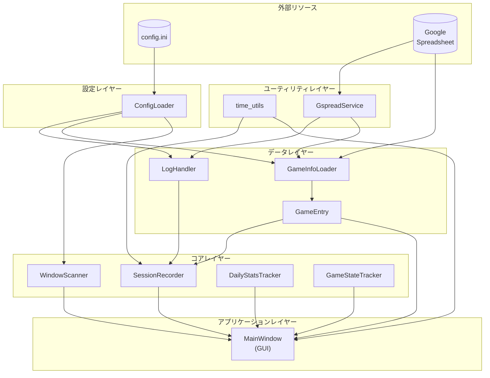
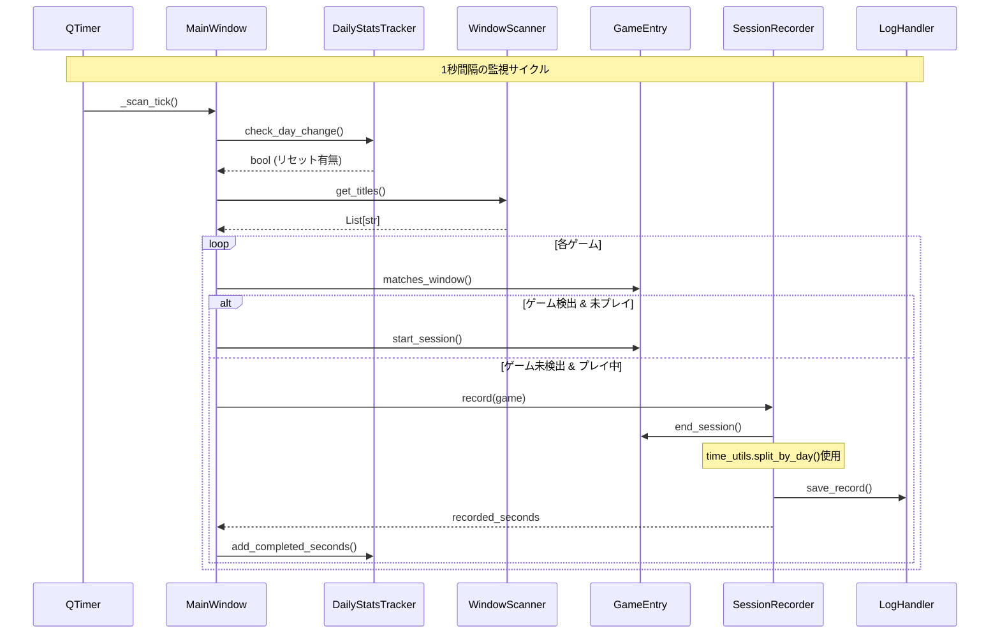

# Game Time Tracker 仕様書

## 目的
Windows PC で実行中のゲームをウィンドウタイトルから自動検出し、プレイ時間を Google スプレッドシートに記録するツール。

## 運用前提（配布形態）
- 通常利用は GitHub Releases で配布する Windows EXE を前提とする。
- `config.ini` / `service_account.json` は EXE に同梱せず、実行時に外部ファイルとして参照する。
- 既定では EXE と同じディレクトリの `config.ini` を読み込む。
- ソースコード実行（`python main.py`）は開発・検証用途とする。

## クラス構成図

### ファイル別クラス一覧

```mermaid
classDiagram
    namespace models_py {
        class GameEntry {
            <<dataclass>>
            +game_title: str
            +window_title: str
            +play_with_friends: bool
            +is_browser_game: bool
            +is_playing: bool
            +start_time: datetime
            +inactive_since: datetime
            +matches_window()
            +start_session()
            +end_session()
            +set_inactive()
            +set_active()
            +is_inactive()
            +get_inactive_seconds()
        }
        class ParsedRecord {
            <<dataclass>>
            +start: datetime
            +end: datetime
            +game_title: str
        }
    }

    namespace time_utils_py {
        class TimeUtils {
            <<module>>
            +GSS_DATETIME_FORMAT: str
            +format_hms(total_seconds) str
            +split_by_day(start, end) List~Tuple~
            +calc_today_elapsed_seconds(start_time, now) float
        }
    }

    namespace services_py {
        class ScanResult {
            <<dataclass>>
            +active_games: List~GameEntry~
            +inactive_games: List~GameEntry~
            +recorded_seconds: float
        }
        class Messages {
            <<constants>>
            GAME_RECORDED
            GAME_TOO_SHORT
            NO_GAME_PLAYING
        }
        class GameInfoLoader {
            +config: Config
            +load() List~GameEntry~
            -_record_to_entry()
        }
        class WindowScanner {
            +excluded_titles: set
            +get_titles() List~str~
            +get_foreground_title() Optional~str~
        }
        class SessionRecorder {
            +log_handler: LogHandler
            +min_play_minutes: int
            +record() Optional~float~
            +record_with_times() Optional~float~
            -_save_to_spreadsheet() bool
        }
        class DailyStatsTracker {
            +today_completed_seconds: float
            +today_game_minutes_cache: Dict
            +check_day_change() bool
            +add_completed_seconds()
            +update_game_minutes_cache()
        }
        class GameStateTracker {
            +active_games: List~GameEntry~
            +inactive_games: List~GameEntry~
            +add_active()
            +remove_active()
            +add_inactive()
            +remove_inactive()
            +clear_all()
        }
    }

    namespace window_state_py {
        class WindowState {
            <<static>>
            +load_all()$ Tuple
            +load()$ Tuple
            +load_overtime_alert_enabled()$ bool
            +save()$
        }
    }

    namespace main_py {
        class OvertimeAlertTracker {
            <<dataclass>>
            +thresholds_minutes: Tuple~int~
            +alerted_threshold_minutes: set~int~
            +last_checked_seconds: float
            +initialized: bool
            +prime()
            +update() List~int~
        }
        class MainWindow {
            <<QWidget>>
            +games: List~GameEntry~
            +scanner: WindowScanner
            +recorder: SessionRecorder
            +daily_stats: DailyStatsTracker
            +state_tracker: GameStateTracker
            +overtime_alert_enabled: bool
            -_init_components()
            -_scan_tick()
            -_ui_tick()
            -_update_game_states()
            -_get_overtime_alert_tracker()
            -_initialize_overtime_alert_toggle()
            -_on_overtime_alert_toggled()
            -_update_overtime_alert()
        }
        class MainWindowStateController {
            +load_all() Tuple
            +load() Tuple
            +load_overtime_alert_enabled() bool
            +save()
            +record_resize()$
        }
    }

    namespace gui_layout_py {
        class SlideToggleButton {
            <<QPushButton>>
            +__init__()
            -_apply_style()
        }
        class LayoutWidgets {
            <<dataclass>>
            +today_label: QLabel
            +today_time_display: QLabel
            +session_label: QLabel
            +session_time_display: QLabel
            +active_label: QLabel
            +active_display: QLabel
            +today_games_label: QLabel
            +today_games_table: QTableWidget
            +window_label: QLabel
            +window_list: QListWidget
            +active_min_height: int
            +active_max_height: int
            +today_games_min_height: int
            +window_min_height: int
            +overtime_alert_toggle: Optional~QPushButton~
        }
    }

    namespace config_loader_py {
        class LogHandlerConfig {
            <<dataclass>>
            +cert_file_path: str
            +sheet_key: str
        }
        class GameInfoConfig {
            <<dataclass>>
            +sheet_key: str
            +sheet_gid: int
        }
        class WindowScanConfig {
            <<dataclass>>
            +browsers: List~str~
            +excluded_titles: List~str~
        }
        class Config {
            <<dataclass>>
            +log_handler: LogHandlerConfig
            +game_info: GameInfoConfig
            +window_scan: WindowScanConfig
        }
        class ConfigLoader {
            +config: ConfigParser
            +load() Config
            -_validate_required_keys()
            -_get_list()
        }
    }

    namespace gspread_service_py {
        class GspreadService {
            +cert_file_path: str
            +sheet_key: str
            +sheet_gid: Optional~int~
            -_sheet: Worksheet
            -_connect()
            +sheet: Worksheet
            +get_all_records() List~Dict~
            +append_row(values) bool
        }
    }

    namespace log_handler_py {
        class LogHandler {
            +gspread_service: GspreadService
            +records: List~Dict~
            +index: int
            +__init__(config: LogHandlerConfig)
            +get_all_records()
            +get_cached_records()
            +get_today_stats() Tuple
            +save_record()
            +format_datetime_to_gss_style()$
            +get_and_increment_index()
        }
    }

    models_py ..> time_utils_py : uses
    services_py ..> time_utils_py : uses
    services_py ..> log_handler_py : uses
    log_handler_py ..> gspread_service_py : uses
    main_py ..> models_py : uses
    main_py ..> services_py : uses
    main_py ..> time_utils_py : uses
    main_py ..> window_state_py : uses
    main_py ..> gui_layout_py : uses
```

### 依存関係図



### 呼び出しフロー



---

## クラス詳細

### models.py

#### `GameEntry` (dataclass)
ゲーム情報を保持するデータクラス。

| メソッド | 説明 | 呼び出し元 |
|----------|------|------------|
| `matches_window(window_title, browsers)` | ウィンドウタイトルがこのゲームに該当するか判定 | `MainWindow._update_game_states()` |
| `start_session()` | ゲームセッションを開始（is_playing=True, start_time設定, inactive_sinceクリア） | `MainWindow._update_game_states()` |
| `end_session()` | セッション終了し開始・終了時刻を返す（inactive_sinceもクリア） | `SessionRecorder.record()` |
| `set_inactive()` | 非アクティブ状態に設定（inactive_sinceを記録） | `MainWindow._update_game_states()` |
| `set_active()` | アクティブ状態に戻す（inactive_sinceクリア） | `MainWindow._update_game_states()` |
| `is_inactive()` | 非アクティブ状態かどうかを返す | `MainWindow._update_game_states()` |
| `get_inactive_seconds()` | 非アクティブ経過秒数を取得 | `MainWindow._update_game_states()` |

#### `ParsedRecord` (dataclass)
パース済みのレコードを保持するデータクラス。

| フィールド | 説明 |
|------------|------|
| `start` | 開始時刻 (datetime) |
| `end` | 終了時刻 (datetime) |
| `game_title` | ゲーム名 |

#### 関数

| 関数 | 説明 | 呼び出し元 |
|------|------|------------|
| `parse_record(record)` | レコードをパースしてParsedRecordを返す。パース失敗時はNone | `LogHandler.get_today_stats()` |
| `parse_bool(value)` | 文字列を bool に変換（"TRUE" → True, その他 → False） | `GameInfoLoader._record_to_entry()` |

---

### services.py

#### `ScanResult` (dataclass)
ゲームスキャン結果を保持するデータクラス。

| フィールド | 説明 |
|------------|------|
| `active_games` | アクティブなゲームのリスト |
| `inactive_games` | 非アクティブなゲームのリスト |
| `recorded_seconds` | この周期で記録された秒数 |

#### `GameInfoLoader`
スプレッドシートからゲーム情報を読み込む。内部で`GspreadService`を生成し、`sheet_gid`指定で対応ワークシートに接続する。

| メソッド | 説明 | 呼び出し元 |
|----------|------|------------|
| `__init__(config)` | Config（dataclass）を受け取って初期化 | `MainWindow._init_components()` |
| `load()` | ゲーム情報リストを取得。内部で`GspreadService(cert_file_path, sheet_key, sheet_gid)`を使用 | `MainWindow._init_components()` |
| `_record_to_entry(record)` | スプレッドシートのレコードをGameEntryに変換（`models.parse_bool()`を使用） | `load()` 内部 |

#### `WindowScanner`
アクティブなウィンドウタイトルを取得する。

| メソッド | 説明 | 呼び出し元 |
|----------|------|------------|
| `__init__(excluded_titles)` | 除外リストを受け取って初期化 | `MainWindow._init_components()` |
| `get_titles()` | 除外リストを考慮してウィンドウタイトル一覧を取得 | `MainWindow._scan_tick()` |
| `get_foreground_title()` | フォアグラウンド（最前面）ウィンドウのタイトルを取得 | `MainWindow._scan_tick()` |

#### `SessionRecorder`
ゲームセッションをスプレッドシートに記録する。

| メソッド | 説明 | 呼び出し元 |
|----------|------|------------|
| `__init__(log_handler, min_play_minutes)` | LogHandlerと最小記録時間を受け取って初期化 | `MainWindow._init_components()` |
| `record(game)` | セッション終了→日付分割→記録。**当日分のみの記録秒数を返す**。5分未満や書き込み失敗など保存が一件も発生しない場合はNone | `MainWindow._update_game_states()` |
| `record_with_times(game, start_time, end_time)` | 指定された開始/終了時刻でセッションを記録。セッションは終了せず継続可能。**当日分のみの記録秒数を返す**。5分未満や書き込み失敗など保存が一件も発生しない場合はNone | `MainWindow._update_game_states()` |
| `_split_by_day(start, end)` | セッションを日付境界で分割 | `record()` / `record_with_times()` 内部 |
| `_save_to_spreadsheet(game, start_time, end_time)` | スプレッドシートに1件保存。**成功時True、失敗時Falseを返す** | `record()` / `record_with_times()` 内部 |

#### `DailyStatsTracker`
日付ごとの統計を追跡し、日付変更時にリセットする。

| メソッド | 説明 | 呼び出し元 |
|----------|------|------------|
| `__init__(get_current_date=None)` | 初期化。テスト用に日付取得関数を差し替え可能 | `MainWindow.__init__()` |
| `check_day_change()` | 日付変更をチェックし、変わっていればリセット | `MainWindow._scan_tick()` |
| `add_completed_seconds(seconds)` | 完了したプレイ時間を追加 | `MainWindow._update_game_states()` |
| `update_game_minutes_cache(cache)` | ゲームごとのプレイ時間キャッシュを更新 | `MainWindow._update_game_states()` |

#### `GameStateTracker`
ゲーム状態の追跡と遷移を管理するクラス。

UIから独立した状態遷移ロジックを提供。
`scan()`を呼び出すことで、ウィンドウ状態に基づいてゲーム状態を更新し、
`ScanResult`（アクティブ/非アクティブなゲームと記録された秒数）を返す。

| メソッド | 説明 | 呼び出し元 |
|----------|------|------------|
| `__init__(recorder, daily_stats, browsers, inactive_timeout_minutes)` | 初期化 | `MainWindow._init_components()` |
| `scan(games, window_titles, foreground_title, load_today_game_minutes_callback)` | ゲーム状態をスキャンして更新。`ScanResult`を返す | `MainWindow._scan_tick()` |

---

### window_state.py

#### `WindowState`
ウィンドウ状態の保存/読み込み用ユーティリティクラス（静的メソッドのみ）。

| メソッド | 説明 | 呼び出し元 |
|----------|------|------------|
| `load_all(path)` | ファイルから `(x, y, display_mode, mode_sizes, overtime_alert_enabled)` を読込。**display_modeが不正な場合は"max"にフォールバック** | `MainWindowStateController.load_all()`, `load()`, `load_overtime_alert_enabled()` |
| `load(path)` | ファイルから `(x, y, display_mode, mode_sizes)` を読込（`load_all()` のラッパー） | `MainWindowStateController.load()` |
| `load_overtime_alert_enabled(path)` | ファイルから `overtime_alert_enabled` を読込（未設定時は `True`） | `MainWindowStateController.load_overtime_alert_enabled()` |
| `save(path, x, y, display_mode, mode_sizes, overtime_alert_enabled=True)` | 現在の状態をファイルに保存（`overtime_alert_enabled` を含む） | `MainWindowStateController.save()` |

---

### main.py

#### `OvertimeAlertTracker` (dataclass)
時間超過防止アラートの閾値通知状態を管理する。

| フィールド | 説明 |
|------------|------|
| `thresholds_minutes` | 通知対象の閾値（分） |
| `alerted_threshold_minutes` | 当日中に通知済みの閾値（分）の集合 |
| `last_checked_seconds` | 直近の判定秒数 |
| `initialized` | 進捗初期化済みかどうか |

| メソッド | 説明 | 呼び出し元 |
|----------|------|------------|
| `prime(total_seconds)` | 現在値を基準に進捗を初期化し、遡及通知を抑止 | `MainWindow._prime_overtime_alert_progress()`, `update()` 初回 |
| `update(total_seconds, alerts_enabled)` | 閾値跨ぎを判定し、今回通知すべき閾値（分）一覧を返す | `MainWindow._update_overtime_alert()` |

#### `MainWindow` (QWidget)
GUI版メインウィンドウ。

| メソッド | 説明 | 呼び出し元 |
|----------|------|------------|
| `__init__()` | 起動フローのオーケストレーション（状態復元→依存ウォームアップ→初期化→タイマー開始） | `main()` 関数 |
| `_initialize_window_state()` | タイトル設定とウィンドウ状態の復元 | `__init__()` 内部 |
| `_initialize_runtime_state()` | 実行時キャッシュ/依存の初期値を設定 | `__init__()` 内部 |
| `_warmup_dependencies()` | UI/表示/loop/bootstrap 依存を事前生成 | `__init__()` 内部 |
| `_start_background_timers()` | 監視/UI更新タイマーを開始 | `__init__()` 内部 |
| `_run_initial_refresh()` | 起動直後の初回スキャン/UI更新を実行 | `__init__()` 内部 |
| `closeEvent(event)` | 終了時の記録・状態保存をオーケストレーション | Qt イベント |
| `_record_playing_games_before_close()` | 終了時に記録対象ゲームを記録 | `closeEvent()` 内部 |
| `_iter_recordable_games()` | 記録対象ゲームのみ抽出 | `_record_playing_games_before_close()` 内部 |
| `_start_timer(interval, callback)` | タイマーを作成して開始 | `__init__()` 内部 |
| `_init_components()` | 設定読み込み、コンポーネント初期化 | `__init__()` 内部 |
| `_resolve_dependency(attr_name, factory, validator=None)` | 依存生成/再利用の共通ロジック | 各 `_get_*` メソッド |
| `_get_ui_controller()` | `MainWindowUiController` を取得（必要時再生成） | UI更新メソッド |
| `_get_display_controller()` | `MainWindowDisplayController` を取得 | 表示モード関連 |
| `_get_state_controller()` | `MainWindowStateController` を取得 | 状態保存/復元関連 |
| `_get_loop_controller()` | `MainWindowLoopController` を取得 | tick/タイマー関連 |
| `_get_bootstrapper()` | `MainWindowBootstrapper` を取得 | `_init_components()` |
| `_scan_tick()` | 監視サイクル（1秒間隔） | タイマー |
| `_scan_games(window_titles, foreground_title)` | `GameStateTracker.scan()` を呼び出して判定結果を取得 | `_scan_tick()` 内部 |
| `_apply_scan_result(window_titles, result)` | スキャン結果をキャッシュ/UIへ反映 | `_scan_tick()` 内部 |
| `_update_scan_status(active_games, inactive_games)` | 計測中/非計測のステータスを更新 | `_apply_scan_result()` 内部 |
| `_update_active_list(active_games)` | プレイ中ゲームリストをUIに反映 | `_scan_tick()` 内部 |
| `_update_session_times(active_games, now)` | 現在のセッション時間をUIに反映 | `_ui_tick()` 内部 |
| `_update_today_totals(active_games, now)` | 今日の合計時間をUIに反映。**日跨ぎセッションは0:00以降のみ、5分未満は除外** | `_ui_tick()` 内部 |
| `_update_window_list(window_titles)` | ウィンドウタイトル一覧をUIに反映 | `_scan_tick()` 内部 |
| `_initialize_window_title_copy()` | `window_list.itemClicked` を接続し、クリックコピー機能を初期化 | `__init__()` |
| `_on_window_title_item_clicked(item)` | クリックしたウィンドウタイトル項目の文字列をコピー | `QListWidget.itemClicked` |
| `_copy_text_to_clipboard(text)` | テキストをクリップボードに設定し、ステータス更新 | `_on_window_title_item_clicked()` |
| `_load_today_game_minutes()` | スプレッドシートから今日のゲーム別時間を集計 | `_init_components()`, `_scan_games()` |
| `_update_today_games_list()` | 今日プレイしたゲーム一覧をUIに反映。**日跨ぎセッションは0:00以降のみ、5分未満は除外** | `_ui_tick()` 内部 |
| `_load_today_completed_seconds()` | 起動時に今日分の完了時間をロード | `_init_components()` 内部 |
| `_save_window_state()` | ウィンドウ位置・サイズ・モードを保存 | `closeEvent()`, `_cycle_display_mode()` |
| `_is_overtime_alert_enabled()` | 時間超過防止アラートの有効状態を返す | `_save_window_state()`, `_update_overtime_alert()`, オーバーレイ判定 |
| `_set_overtime_alert_enabled(enabled)` | 時間超過防止アラートの有効状態を更新 | `_on_overtime_alert_toggled()` |
| `_get_overtime_alert_tracker()` | アラート閾値跨ぎ判定用トラッカーを取得（必要時生成） | `_prime_overtime_alert_progress()`, `_update_overtime_alert()` |
| `_get_overtime_alert_toggle()` | レイアウト上のアラートトグルウィジェット参照を取得 | `_initialize_overtime_alert_toggle()` |
| `_initialize_overtime_alert_toggle()` | トグル初期状態を反映し、`toggled` シグナルを接続 | `_init_components()` |
| `_on_overtime_alert_toggled(checked)` | トグル変更時に有効状態を更新し、進捗再初期化とオーバーレイ同期を実行 | `QPushButton.toggled` |
| `_prime_overtime_alert_progress(total_seconds)` | 現在値を基準に通知進捗を初期化（遡及通知防止） | 日付変更時, `_on_overtime_alert_toggled()` |
| `_emit_overtime_alert(threshold_minutes)` | 閾値到達アラートを通知（`QApplication.beep()` + ログ） | `_update_overtime_alert()` |
| `_update_overtime_alert(total_seconds)` | 閾値跨ぎを検知して未通知閾値のみアラート通知 | `_ui_tick()` |
| `_set_status(message)` | ステータスをタイトルバーに反映 | 各所 |
| `_apply_mode_geometry()` | 表示モードに応じたサイズを適用 | `_apply_display_mode()` 内部 |
| `_apply_display_mode()` | 表示モードに応じてウィジェット表示を切替 | `_init_components()`, `_cycle_display_mode()` |
| `_set_widget_visibility(widget, visible)` | ウィジェットの表示/非表示を設定 | `_apply_display_mode()` 内部 |
| `_set_widget_with_height(widget, visible, min_height, max_height)` | ウィジェットの表示と高さ制約を設定 | `_apply_display_mode()` 内部 |
| `mousePressEvent(event)` | クリックで表示モードをトグル | Qt イベント |
| `_should_cycle_display_mode(event)` | 表示モード切り替え対象クリックかを判定 | `mousePressEvent()` 内部 |
| `_cycle_display_mode()` | 表示モードを循環 | `mousePressEvent()` 内部 |
| `resizeEvent(event)` | リサイズ時にサイズを記録 | Qt イベント |
| `_record_current_mode_size()` | 現在モードのサイズを `mode_sizes` に記録 | `resizeEvent()` 内部 |
| `_ui_tick()` | UI高速更新（0.1秒間隔） | タイマー |

#### `MainWindow` 内部コントローラー

| クラス | 役割 | 主要メソッド |
|--------|------|--------------|
| `MainWindowUiController` | `active/session/today/windows` のUI更新を担当 | `update_session_times()`, `update_today_totals()`, `update_today_games_list()` |
| `MainWindowDisplayController` | `min/mid/max` 表示モードの可視性・サイズ制約・ジオメトリ適用を担当 | `apply_display_mode()`, `apply_mode_geometry()`, `next_display_mode()` |
| `MainWindowStateController` | ウィンドウ状態の読み書きとリサイズ記録を担当 | `load_all()`, `save()`, `record_resize()` |
| `MainWindowLoopController` | タイマー生成と `scan_tick/ui_tick` 実行フローを担当 | `start_timer()`, `run_scan_tick()`, `run_ui_tick()` |
| `MainWindowBootstrapper` | 初期化依存構築と初期統計ロードを担当（失敗時は `MainWindowBootstrapError`） | `bootstrap()` |
| `MainWindowOverlayController` | オーバーレイの初期化・表示条件判定・可視同期を担当 | `initialize_overlay()`, `should_show_overlay()`, `sync_overlay()` |

---

### gui_layout.py

#### `LayoutWidgets` (dataclass)
ウィジェット参照を保持するデータクラス。

| フィールド | 説明 |
|------------|------|
| `today_label`, `today_time_display` | 今日のプレイ時間表示 |
| `session_label`, `session_time_display` | 現在のセッション時間表示 |
| `active_label`, `active_display` | プレイ中ゲーム表示 |
| `today_games_label`, `today_games_table` | 今日プレイしたゲーム一覧 |
| `window_label`, `window_list` | ウィンドウタイトル一覧 |
| `overtime_alert_toggle` | 時間超過防止アラートのON/OFFトグル（`SlideToggleButton`） |
| `active_min_height`, `active_max_height`, `today_games_min_height`, `window_min_height` | 各ウィジェットの高さ定数 |

#### `SlideToggleButton` (QPushButton)
時間超過防止アラート用の小型スライドトグル。

| メソッド | 説明 | 呼び出し元 |
|----------|------|------------|
| `__init__(parent=None)` | チェック可能ボタンとして初期化し、トグル時スタイル更新を接続 | `build_main_layout()` |
| `_apply_style(checked)` | ON/OFFでノブ位置（左/右）と色を切り替える | `__init__()`, `toggled` シグナル |

#### `build_main_layout(parent)` (関数)
メインレイアウトを構築して `LayoutWidgets` を返す。

| 呼び出し元 |
|------------|
| `MainWindow.__init__()` |

---

### config_loader.py

#### 定数
- `DEFAULT_CONFIG_FILE = 'config.ini'` - デフォルトの設定ファイルパス
- `DEFAULT_BROWSERS` - デフォルトのブラウザリスト
- `DEFAULT_EXCLUDED_TITLES` - デフォルトの除外タイトルリスト

#### データクラス

##### `LogHandlerConfig`
ログハンドラー設定を保持するデータクラス。
- `cert_file_path: str` - 認証情報ファイルのパス
- `sheet_key: str` - スプレッドシートのキー

##### `GameInfoConfig`
ゲーム情報設定を保持するデータクラス。
- `sheet_key: str` - スプレッドシートのキー
- `sheet_gid: int` - シートのGID

##### `WindowScanConfig`
ウィンドウスキャン設定を保持するデータクラス。
- `browsers: List[str]` - 対応ブラウザのリスト
- `excluded_titles: List[str]` - 除外するタイトルのリスト

##### `Config`
アプリケーション全体の設定を保持するデータクラス。
- `log_handler: LogHandlerConfig` - ログハンドラー設定
- `game_info: GameInfoConfig` - ゲーム情報設定
- `window_scan: WindowScanConfig` - ウィンドウスキャン設定

#### `ConfigLoader`
config.ini を読み込んで型付き設定（`Config`）を提供する。

| メソッド | 説明 | 呼び出し元 |
|----------|------|------------|
| `__init__(config_file_path=DEFAULT_CONFIG_FILE)` | 指定されたconfig.ini を読み込み、**必須キーを検証** | `MainWindow._init_components()`, `LogHandler.__init__()` |
| `_validate_required_keys()` | 必須キー（LOGHANDLER/GAMEINFOセクション）の存在を検証。欠落時はKeyError | `__init__()` 内部 |
| `load() -> Config` | 設定を読み込んで`Config`データクラスを返す。**sheet_gidはintに変換** | `MainWindow._init_components()`, `LogHandler.__init__()` |
| `_get_list(section, key, default)` | カンマ区切りの設定をリストに変換 | `load()` 内部 |

---

### gspread_service.py

#### `GspreadService`
Google Spreadsheet操作を抽象化するサービスクラス。

| メソッド | 説明 | 呼び出し元 |
|----------|------|------------|
| `__init__(cert_file_path, sheet_key, *, sheet_gid=None)` | 認証情報とシートキーを設定し、スプレッドシートに接続。`sheet_gid`指定時は対応ワークシート、省略時はsheet1に接続 | `LogHandler.__init__()`, `GameInfoLoader.load()` |
| `_connect()` | スプレッドシートに接続。`sheet_gid`がある場合は`get_worksheet_by_id()`で接続 | `__init__()` 内部 |
| `sheet` | ワークシートプロパティ。未接続時は`RuntimeError`をスロー | 内部 |
| `get_all_records() -> List[Dict]` | 全レコードを取得 | `LogHandler.get_all_records()`, `GameInfoLoader.load()` |
| `append_row(values) -> bool` | 行を追加。成功時True、失敗時False | `LogHandler.save_record()` |

---

### log_handler.py

#### `LogHandler`
スプレッドシートの読み書きを担当する。起動時に全レコードをメモリにキャッシュし、API呼び出しを最小化。
`GspreadService`を使用してスプレッドシート操作を実行。

| メソッド | 説明 | 呼び出し元 |
|----------|------|------------|
| `__init__(config: LogHandlerConfig)` | `LogHandlerConfig`（認証情報パスとシートキー）を受け取り、`GspreadService`を初期化。全レコードをキャッシュ（`self.records`）に保存。**接続失敗時は例外をスロー** | `MainWindowBootstrapper.bootstrap()` |
| `get_all_records()` | `GspreadService`経由で全レコードを取得（初期化時のみ使用） | `__init__()` 内部 |
| `get_cached_records()` | キャッシュされたレコード（`self.records`）を返す。API呼び出しなし | `get_today_stats()` 内部 |
| `get_today_stats() -> Tuple[Dict[str, float], float]` | 今日のゲーム別プレイ時間と合計秒数を計算して返す。キャッシュのみ使用、API呼び出しなし | `MainWindow._load_today_game_minutes()`, `MainWindow._load_today_completed_seconds()` |
| `get_and_increment_index()` | インデックスを取得して+1 | `SessionRecorder._save_to_spreadsheet()` |
| `format_datetime_to_gss_style(datetime)` | datetimeをスプレッドシート形式に変換 | `SessionRecorder._save_to_spreadsheet()` |
| `save_record(values)` | `GspreadService`経由で1行をスプレッドシートに追記し、同時に`self.records`にも追加してキャッシュを更新。**成功時True、失敗時Falseを返す** | `SessionRecorder._save_to_spreadsheet()` |

---

## システム構成
- **[src/app/main.py](../src/app/main.py)** (PySide6 GUI + 自動検出・ログ記録)
  - `MainWindow` がメインループを管理し、ポーリング間隔/最小記録時間を定数で設定可能。
  - `pygetwindow` で全ウィンドウのタイトルを取得。
  - ゲーム情報シートから登録されたゲームを読み込み、部分一致で検出。
  - ブラウザタイトルは `is_browser_game=True` のゲームのみ記録対象。
  - 1秒間隔でポーリング。ウィンドウ消失時に終了時刻を確定。
  - 5分以上のプレイのみスプレッドシートへ追記。
  - ステータスをタイトルバーに表示し、左クリックで表示モード切替（max/mid/min）。
  - ウィンドウ検出は1秒間隔、UI更新は0.1秒間隔。
  - 位置・サイズ・モードを `window_state.txt` に保存/復元。
  - `WindowState` クラス: 静的メソッドのみのシンプルなユーティリティクラス（`load_all()`/`load()`/`save()`）。
  - `MainWindow`: ウィジェット参照を `self.w` に統合、タイマー初期化ヘルパー `_start_timer()` で簡潔化。
  - 状態管理の二重化を解消し、約30行のコード削減を実現。
  - **今日プレイしたゲーム一覧表示**（mid/maxモード）:
    - その日にプレイしたゲームとプレイ時間（分数）を表示
    - プレイ時間の長い順にソート
    - スプレッドシートへのアクセスは起動時とゲーム記録時のみ（キャッシュを活用）
    - UI更新時は差分更新により、ちらつきを防止

- **[src/ui/gui_layout.py](../src/ui/gui_layout.py)**
  - GUI ウィジェットとレイアウトの構築。各ウィジェットのデフォルト高さを保持。
  
- **[src/infra/log_handler.py](../src/infra/log_handler.py)**
  - サービスアカウント経由でスプレッドシートを操作。
  - ログ行を末尾に追記。
  - ログシートの読み込み/追記とインデックス管理を行う。
  - **キャッシュ機構**: 起動時に全レコードを`self.records`（`List[dict]`）にキャッシュし、`get_cached_records()`で取得。`save_record()`はスプレッドシート書き込みと同時にキャッシュも更新。UI更新時のAPI呼び出しを排除。

- **[src/infra/config_loader.py](../src/infra/config_loader.py)**
  - `config.ini` を読み込み。
  - スプレッドシートキー、ゲーム情報シートの gid、サービスアカウント JSON パスを提供。

## 設定・外部リソース
- **[config.ini](../config.ini)**
  ```ini
  [LOGHANDLER]
  json_file_path = service_account.json    ; サービスアカウント JSON のパス
  sheet_key = <スプレッドシートキー>        ; ログシートのキー

  [GAMEINFO]
  sheet_key = <スプレッドシートキー>        ; ゲーム情報シートのキー
  sheet_gid = 1198224769                   ; ゲーム情報シートの gid

  [WINDOW_SCAN]
  browsers = Google Chrome, Microsoft Edge, Mozilla Firefox, Opera, Brave, Vivaldi, Safari
  exclude_titles = Program Manager, Settings, 設定, NVIDIA GeForce Overlay, Windows 入力エクスペリエンス, Microsoft Store, game_time_tracker.bat, Nahimic
  ```

- **スプレッドシート構造**
  - **ログシート (sheet1)**: `index, start_time, end_time, title, play_with_friends`
  - **ゲーム情報シート**: `game_title, window_title, play_with_friends, is_browser_game`
    - 真偽値は `"TRUE"` / `"FALSE"` 文字列として保存。読込時は `_parse_bool` で判定。

- **[service_account.json](../service_account.json)**
  - Google Cloud サービスアカウント秘密鍵。
  - `.gitignore` で除外管理。

## 自動検出フロー
1. 起動時にゲーム情報シートを読み込み、`game_title/window_title/play_with_friends/is_browser_game` をメモリに保持。
2. 1秒間隔（`POLL_INTERVAL_SECONDS = 1`）で以下を実行：
   - 全ウィンドウのタイトルを取得（`pygetwindow.getAllWindows()`）。
   - フォアグラウンド（最前面）ウィンドウのタイトルを取得（`pygetwindow.getActiveWindow()`）。
   - 除外リスト（Program Manager など）を外す。
   - 各ゲームの `window_title` が部分一致するか判定。
3. フォアグラウンドで一致したゲームのみ：
   - `is_playing=True` とし、初回一致時に `start_time` を記録。
   - バックグラウンド一致のみではセッションを開始しない。
   - ブラウザゲーム判定：
     - `is_browser_game=True` の場合、ブラウザタイトルでも記録対象。
     - `is_browser_game=False` の場合、ブラウザウィンドウを除外（ブラウザ名で判定）。
4. 一致がなくなった瞬間：
   - `is_playing=False` とし、`end_time` を記録。
   - プレイ時間計算: `(end_time - start_time).total_seconds() / 60` (分単位)。
   - **5分以上のプレイのみ** `[index, start, end, game_title, play_with_friends]` をログシートへ追記。
   - 5分未満の場合は破棄。
   - 開始・終了時刻は `YYYY/MM/DD HH:MM:SS` 形式に整形。
5. ステータス表示（GUI）：
   - **タイトルバー**: ゲーム実行中は「プレイ時間計測中」、未実行時は「ゲームをプレイしていません」
   - **標準出力**: ゲーム終了時のみメッセージ出力
     - 5分以上: `{game_title}のプレイ時間を記録しました`
     - 5分未満: `{game_title}のプレイ時間が5分未満のため、記録されませんでした`
     - 書き込み失敗: `{game_title}の記録保存に失敗しました`

## 非アクティブウィンドウトラッキング

### 概要
セッション開始後にフォアグラウンド（最前面）でなくなった場合は「非アクティブ」として扱う。
（バックグラウンド一致のみではセッションは開始しない）
非アクティブ状態が5分以上続くと、その時点でセッションを記録し、次にアクティブになった際は新しいセッションとして扱う。

### 定数
- `INACTIVE_TIMEOUT_MINUTES = 5` - 非アクティブ状態のタイムアウト時間（分）

### 状態判定

| ウィンドウ状態 | フォアグラウンド | アクティブ判定 |
|----------------|------------------|----------------|
| ゲームウィンドウが存在し、最前面 | ✓ | アクティブ |
| ゲームウィンドウが存在するが、最前面ではない | ✗ | 非アクティブ（計測中のみ） |
| ゲームウィンドウが存在しない | - | セッション終了 |

### 非アクティブ時の動作

#### 5分未満で再アクティブ化
1. 非アクティブになった時刻を `inactive_since` に記録
2. 5分未満で再度フォアグラウンドになった場合
3. `inactive_since` をクリアし、セッション継続
4. 非アクティブだった時間もプレイ時間に**含める**

#### 5分以上の非アクティブ
1. 非アクティブ状態が5分以上続いた場合
2. `inactive_since` の時点でセッションを自動記録（`record_with_times()`）
3. セッションを終了（`is_playing=False`, `start_time=None`, `inactive_since=None`）
4. 再度フォアグラウンドになった場合、`start_session()` で新セッション開始

#### ウィンドウ消失時
1. 非アクティブ状態でウィンドウが消失した場合
2. ウィンドウ消失時点でセッションを記録（`record()`）
3. 非アクティブだった時間もプレイ時間に**含める**

### GUI表示
- 非アクティブ状態のゲームは「ゲーム名 - 停止中」と表示
- プレイ中ゲーム一覧には非アクティブゲームも含まれる
- 今日のプレイ時間には非アクティブ時間も含まれる

### シーケンス図

```
[アクティブ] → [非アクティブ] → (5分以内) → [アクティブ]
    │              │                            │
    │              └── inactive_since記録       └── inactive_since=None
    │                                               セッション継続
    └── 通常のプレイ時間計測

[アクティブ] → [非アクティブ] → (5分経過) → [アクティブ]
    │              │                │           │
    │              └── inactive_since記録        │
    │                              │             └── start_time更新
    │                              │                 新セッション開始
    │                              │
    │                              └── record_with_times()
    │                                  (start_time〜inactive_since)
    └── 通常のプレイ時間計測

[アクティブ] → [非アクティブ] → [ウィンドウ消失]
    │              │                 │
    │              └── inactive_since記録
    │                               │
    │                               └── record()
    │                                   (非アクティブ時間含む)
    └── 通常のプレイ時間計測
```

## ウィンドウタイトル判定アルゴリズム

```python
# 各ゲームについて
for game in games:
    window_exists = any(
        game.matches_window(title, self.browsers)
        for title in window_titles
    )
    is_foreground = (
        foreground_title is not None
        and game.matches_window(foreground_title, self.browsers)
    )

    if not game.is_playing and is_foreground:
        game.start_session()
    elif game.is_playing and not window_exists:
        self.recorder.record(game)
    # game.is_playing かつ not is_foreground の場合は非アクティブ処理へ
```

### GameEntry.matches_window()
```python
def matches_window(self, window_title: str, browsers: Sequence[str]) -> bool:
    if self.window_title not in window_title:
        return False

    is_browser = any(browser in window_title for browser in browsers)

    # ブラウザゲームの場合は常にマッチ
    if self.is_browser_game:
        return True

    # 通常ゲームの場合はブラウザ以外でマッチ
    return not is_browser
```

## GUI 表示モード

### max モード（全表示）
- 今日のプレイ時間（HH:MM:SS.F形式）
- 現在のセッション時間
- プレイ中のゲーム
- 今日プレイしたゲーム一覧（ゲーム名: XX分）
- 現在のウィンドウタイトル一覧
  - 各行をクリックするとそのタイトル文字列をクリップボードへコピー可能
- 設定エリア（最下部）
  - `時間超過防止アラート` トグル

### mid モード
- 今日のプレイ時間（HH:MM:SS.F形式）
- 現在のセッション時間
- プレイ中のゲーム
- 今日プレイしたゲーム一覧（ゲーム名: XX分）
- 設定エリア（最下部）
  - `時間超過防止アラート` トグル

### min モード（最小表示）
- 今日のプレイ時間
- 設定エリア（最下部）
  - `時間超過防止アラート` トグル

## 1時間アラート（時間超過防止）

### 目的
- プレイ時間を1日1時間（60分）の目安で管理するため、段階的にアラートを鳴らす。
- 「時間超過防止アラート」を無効化したいときは、トグルで即時OFFできるようにする。
- トグルがOFFの間は、オーバーレイの時間表示を完全に無効化する。

### 仕様（ユーザー向け）
- 追加UI: `時間超過防止アラート` トグル（ON/OFF）
  - 初期値: ON
  - 配置: ウィンドウ最下部の設定エリア
  - 配置詳細: 設定エリア内で左詰め（ラベルの右にスイッチ）
  - 表示モード: `max/mid/min` すべてで表示（特に `mid/min` でも常時表示）
  - 表示形式: ノブが左右に移動する小型スライドスイッチ（コンパクト表示）
- アラート閾値（分）:
  - `45, 50, 55, 58, 60`
- アラート音:
  - 各閾値に到達した瞬間に1回のみ鳴る（同一日で再通知しない）
- トグルOFF時:
  - アラート音を鳴らさない
  - オーバーレイ時間表示を非表示にする（表示中なら即時で閉じる/隠す）

### 判定ルール（内部仕様）
- アラート判定に使う「今日のプレイ時間」は、既存の `today_time_display` と同じ計算値を使用する。
  - `完了分 + 進行中分`（日跨ぎ時は当日0:00以降のみ）
- 閾値判定は「閾値を下から上にまたいだ瞬間」に発火する。
  - 例: 前回 44:59、今回 45:01 -> 45分アラート発火
- 当日中に発火済みの閾値は再通知しない（重複防止）。
- 日付変更時に発火済み状態をリセットする。
- 起動時またはトグル再ON時に既に閾値を超過している場合:
  - 過去分をさかのぼって一括通知しない
  - その時点以降に未到達閾値をまたいだときのみ通知する
- 曜日・祝日判定は行わない（システム側のカレンダー判定なし）。
  - 通知可否は `時間超過防止アラート` トグル状態のみで決定する。

### オーバーレイ連携
- 既存のオーバーレイ表示条件に以下を追加:
  - `時間超過防止アラート == ON` のときのみオーバーレイ表示判定を実行
- `時間超過防止アラート == OFF` の間は、オーバーレイ表示判定をスキップし常時非表示。

### 永続化
- トグル状態は `window_state.txt` に保存・復元する。
  - 追加キー（案）: `overtime_alert_enabled: bool`
  - 旧形式ファイル（キーなし）読み込み時は `True` 扱い

### 受け入れ条件
1. トグルONで、45/50/55/58/60分到達時に各1回だけアラートが鳴る。
2. 同一閾値は同日中に重複して鳴らない。
3. `mid/min` モードでも、`時間超過防止アラート` トグルがウィンドウ最下部に表示される。
4. トグルOFF直後にオーバーレイが非表示になり、以後表示されない。
5. トグルOFF中はアラートが鳴らない。
6. 日付変更で閾値通知状態がリセットされる。
7. アプリ再起動後もトグル状態が復元される。

## 日を跨いだ時の処理

### 概要
深夜0時を跨いでゲームをプレイした場合、プレイ時間を日付ごとに分割して正確に記録する。

### シナリオ例
- **例1**: 23:30 開始 → 翌日 01:30 終了
  - 当日分: 23:30 - 23:59:59 (30分)
  - 翌日分: 00:00:00 - 01:30 (90分)
  - → 2件のレコードとして記録

- **例2**: 深夜2時を跨ぐ長時間プレイ（23:00 → 翌日 03:00）
  - 当日分: 23:00 - 23:59:59 (60分)
  - 翌日分: 00:00:00 - 03:00 (180分)

### 実装方針

#### 1. SessionRecorder.record() の分割ロジック
```python
def record(self, game: GameEntry) -> Optional[float]:
    """ゲームセッションを終了して記録。日を跨いだ場合は分割。
    
    Returns:
        当日分のみの記録秒数。5分未満や書き込み失敗など保存が一件も発生しない場合はNone。
    """
    start_time, end_time = game.end_session()
    if start_time is None or end_time is None:
        return None
    
    today = datetime.now().date()
    today_seconds = 0.0
    any_saved = False
    segments = self._split_by_day(start_time, end_time)
    
    for seg_start, seg_end in segments:
        play_minutes = (seg_end - seg_start).total_seconds() / 60
        if play_minutes >= self.min_play_minutes:
            success = self._save_to_spreadsheet(game, seg_start, seg_end)
            if success:
                any_saved = True
                # 当日分のみ加算
                if seg_start.date() == today:
                    today_seconds += (seg_end - seg_start).total_seconds()
    
    return today_seconds if any_saved else None

# time_utils.split_by_day()を使用してセッションを分割
# 詳細はtime_utils.pyを参照
```

#### 2. GUI の日付変更検出
GUIでは、以下のタイミングで日付変更を検出：

```python
def _scan_tick(self) -> None:
    """監視サイクル（1秒間隔）."""
    if self.daily_stats.check_day_change():
        # 日付変更時、UIも強制クリア
        self.w.today_games_table.setRowCount(0)
    # ... 既存の処理

# DailyStatsTracker 内のメソッド
def check_day_change(self) -> bool:
    """日付が変わった場合、統計をリセット。"""
    today = self._get_current_date()
    if today != self._last_checked_date:
        self._last_checked_date = today
        self.today_completed_seconds = 0.0
        self.today_game_minutes_cache = {}
        self.last_today_games_content = ""
        return True
    return False
```

### 境界ケース

| ケース | 処理 |
|--------|------|
| 5分未満のセグメント | 各セグメント単位で5分判定。5分未満のセグメントは記録しない |
| 複数日を跨ぐ（稀） | 各日付ごとに分割して記録 |
| 0:00ちょうどに終了 | 前日 23:59:59 までを前日分として記録 |
| 0:00ちょうどに開始 | 通常通り当日分として記録 |
| **進行中セッションが日跨ぎ** | GUIの「今日の合計」「今日の一覧」は0:00以降のみをカウント |
| **進行中セッションが5分未満** | GUIの「今日の合計」「今日の一覧」には含めない |

### 注意事項
- 分割されたセグメントは、それぞれ独立したレコードとして記録される
- 5分未満の判定は分割後の各セグメントに対して行う
- GUIの「今日プレイしたゲーム一覧」は日付変更時に自動リセット

## 非機能要件・制約
- **OS**: Windows（`tkinter` 不要、`pygetwindow/pywin32` に依存）。
- **時刻**: ローカルタイムで算出、タイムゾーン変換なし。
- **スキャン間隔**: 1秒固定（`POLL_INTERVAL_SECONDS = 1`）。
- **最小記録時間**: 5分以上（`MIN_PLAY_MINUTES = 5`）。
- **部分一致**: ウィンドウタイトルの部分一致に依存。共通する文字列を登録する必要がある（例: Terraria）。
- **スプレッドシートアクセス**: GUI版では起動時とゲーム記録時のみアクセス（UI更新時はキャッシュを使用）。キャッシュは`LogHandler.records`（`List[dict]`）に保持され、`get_cached_records()`で取得。記録時は`save_record()`がスプレッドシートとキャッシュを同時更新。
- **日跨ぎ処理**: プレイセッションが深夜0時を跨いだ場合、日付ごとに分割して記録。

## 起動方法
```powershell
python main.py
```
または
```powershell
game_time_tracker.bat
```

## TODO の進捗
- ✅ ログ取得機能_V1 (手動操作での取得は削除)
- ✅ ログ取得機能_V3 (自動検出実装)
  - ウィンドウタイトルから自動判別
  - Google スプレッドシートへ自動保存

## 開発
- テスト: `python -m unittest`（`tests/` 配下を検出）
  - `tests/test_stubs.py` - 共通テストスタブ（PySide6/gspread/pygetwindowのフェイク、FakeLogHandler）
  - `tests/test_main.py` - MainWindow/GUI関連テスト
  - `tests/test_models.py` - models.pyのテスト
  - `tests/test_services.py` - services.pyのテスト
  - `tests/test_time_utils.py` - time_utils.pyのテスト
  - `tests/test_config.py` - config_loader.pyのテスト
  - `tests/test_log_handler.py` - log_handler.py/gspread_service.pyのテスト
  - `tests/test_window_state.py` - window_state.pyのテスト
  - `tests/test_gui.py` - DailyStatsTracker/format_hmsのテスト
- ポーリング間隔・最小記録時間: `src/app/main.py` の `POLL_INTERVAL_SECONDS` と `src/core/services_domain.py` の `MIN_PLAY_MINUTES` で調整。
- 対応ブラウザ・除外ウィンドウ: `config.ini` の `[WINDOW_SCAN]` または `config_loader.DEFAULT_BROWSERS/DEFAULT_EXCLUDED_TITLES` で設定。
